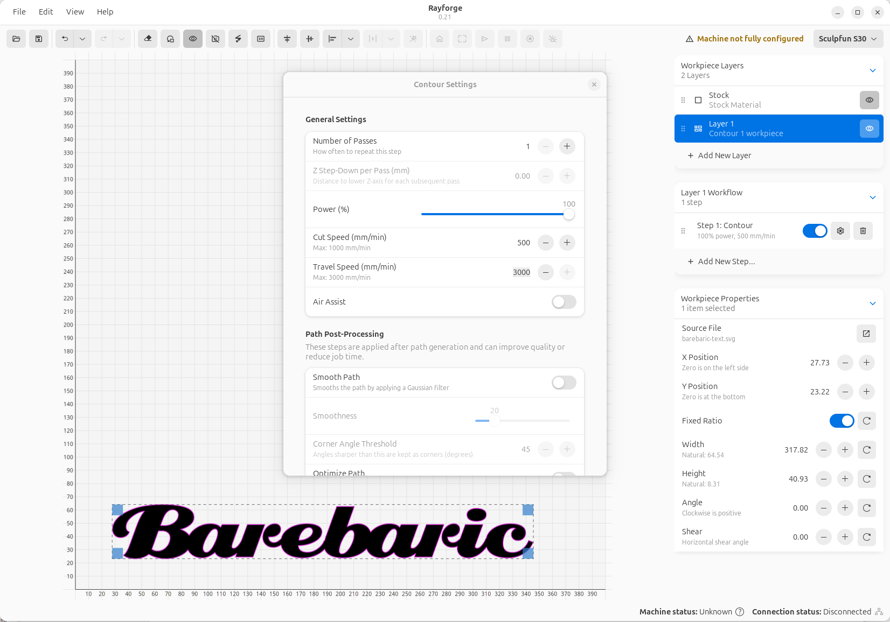

# Rayforge

Rayforge is a modern, cross-platform G-code sender and control software for GRBL-based laser cutters and engravers. Built with Gtk4 and Libadwaita, it provides a clean, native interface for Linux and Windows, offering a full suite of tools for both hobbyists and professionals.

## Documentation

- User documentation at [rayforge.org](https://rayforge.org).
- Developer documentation in [docs](docs/README.md).

## License

This project is licensed under the **MIT License**. See the `LICENSE` file for details.
