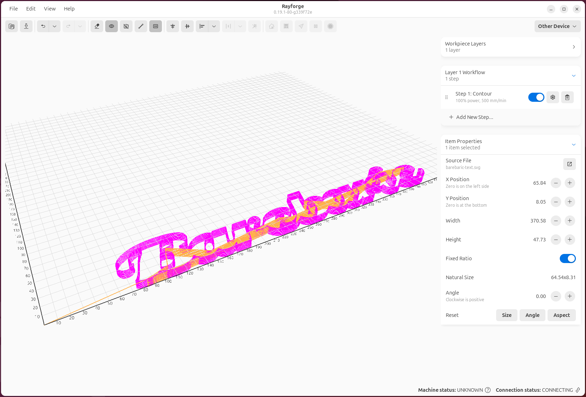

---
date:
  created: 2025-02-20
authors:
  - rayforge_team
categories:
  - Tips & Tricks
tags:
  - engraving
  - optimization
  - quality
  - workflow
---

# 5 Tips for Better Laser Engraving Results with Rayforge

{align=left width="200px"}

Getting professional-quality laser engraving results requires more than just good hardware—your software settings and workflow matter too. Here are five tips to help you get the most out of Rayforge. 

<!-- more -->

## 1. Use Overscan for Smoother Raster Engraving

When doing raster engraving, one common issue is visible lines or inconsistencies at the edges where the laser changes direction. This happens because the laser head needs to decelerate and accelerate, which can affect engraving quality.

**Solution**: Enable **Overscan** in your raster operation settings.

Overscan extends the laser's travel path beyond the actual engraving area, allowing the head to reach full speed before entering the work area and maintain that speed throughout. This results in much smoother, more consistent engraving.

<!--  -->

To enable overscan:

1. Select your raster operation
2. Open the operation settings
3. Enable "Overscan" and set the distance (typically 3-5mm works well)

Learn more in our [Overscan & Kerf guide](../../features/overscan-kerf.md).

## 2. Optimize Travel Time with Path Ordering

For contour operations with many separate paths, the order in which the laser visits each shape can significantly impact total job time.

**Solution**: Use Rayforge's built-in **travel time optimization**.

Rayforge can automatically reorder paths to minimize non-cutting travel time. This is especially useful for jobs with many small objects or text with multiple letters.

The path optimization is typically enabled by default, but you can verify and adjust it in the Contour operation settings.

## 3. Add Holding Tabs to Prevent Part Movement

Nothing is more frustrating than having a nearly-finished cut job ruined because the part shifted or fell through the machine bed at the last moment.

**Solution**: Use **Holding Tabs** to keep parts in place until the job is complete.

Holding tabs are small uncut sections that keep your part connected to the surrounding material. After the job completes, you can easily remove the part and clean up the tabs with a knife or sandpaper.

Rayforge supports both manual and automatic tab placement:

- **Manual**: Click exactly where you want tabs in the canvas
- **Automatic**: Specify the number of tabs and let Rayforge distribute them evenly

Check out the [Holding Tabs documentation](../../features/holding-tabs.md) for a complete guide.

## 4. Preview Your Job in 3D Before Running

One of Rayforge's most valuable features is the 3D G-code preview. It's tempting to skip this step and send the job directly to the machine, but taking a moment to preview can save you time and materials.

**What to look for in the preview**:

- Verify all operations are executing in the correct order
- Check for any unexpected toolpaths or overlaps
- Confirm that multi-pass operations have the correct number of passes
- Ensure the job bounds fit within your material

To open the 3D preview, click the **3D Preview** button in the main toolbar after generating your G-code.

Learn more about the 3D preview in our [UI documentation](../../ui/3d-preview.md).

## 5. Use Custom G-code Hooks for Consistent Workflows

If you find yourself running the same G-code commands before or after every job—like homing, turning on an air assist, or running a focus routine—you can automate this with **G-code Macros & Hooks**.

**Common use cases**:

- **Pre-job hook**: Home the machine, turn on air assist, run an auto-focus routine
- **Post-job hook**: Turn off air assist, return to home position, play a completion sound
- **Layer-specific macros**: Change focus height between operations, switch laser modules

Hooks support variable substitution, so you can reference job properties like material thickness, operation type, and more.

Example pre-job hook:

```gcode
G28 ; Home all axes
M8 ; Turn on air assist
G0 Z{focus_height} ; Move to focus height
```

See our [G-code Macros & Hooks guide](../../features/macros-hooks.md) for detailed examples and variable reference.

---

## Bonus Tip: Test on Scrap Material First

While this isn't specific to Rayforge, it's worth repeating: always test new settings, operations, or materials on scrap first. Use Rayforge's material profiles and operation presets to save your tested settings for future use.

---

*Have your own Rayforge tips and tricks? Share them with the community on [GitHub Discussions](https://github.com/barebaric/rayforge/discussions)!*
