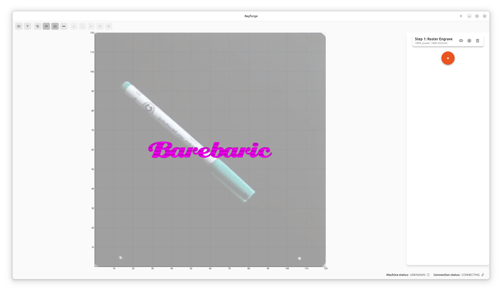

---
date:
  created: 2025-01-10
authors:
  - rayforge_team
categories:
  - Updates
tags:
  - multi-laser
  - operations
  - workflow
---

# Multi-Laser Support: Choose Different Lasers for Each Operation

{align=left width="200px"}

One of the most powerful features in Rayforge is the ability to assign different lasers to different operations within a single job. This opens up exciting possibilities for multi-tool setups and specialized workflows.
 
<!-- more -->

## What is Multi-Laser Support?

If your machine is equipped with multiple laser modules—say, a diode laser for engraving and a CO2 laser for cutting, or different power diode lasers optimized for different materials—Rayforge lets you take full advantage of this setup.

With multi-laser support, you can:

- **Assign different lasers to different operations** in your job
- **Switch between laser modules** automatically during job execution
- **Optimize for material and task** by using the right tool for each operation

## Use Cases

### Hybrid Engraving and Cutting

Imagine you're working on a wooden sign project:

1. **Operation 1**: Use a low-power diode laser to engrave fine text and detailed graphics
2. **Operation 2**: Switch to a higher-power CO2 laser to cut out the sign shape

With Rayforge, you simply assign each operation to the appropriate laser in your machine profile, and the software handles the rest.

### Material-Specific Optimization

Different laser types excel at different materials:

- **Diode lasers**: Great for wood engraving, leather, and some plastics
- **CO2 lasers**: Excellent for cutting acrylic, wood, and other organic materials
- **Fiber lasers**: Perfect for marking metals

If you have multiple laser types on a gantry system, Rayforge's multi-laser support lets you use the optimal tool for each part of your project.

## How to Set It Up

### 1. Configure Multiple Lasers in Your Machine Profile

Go to **Machine Setup → Multiple Lasers** and define each laser module in your system. You can specify:

- Laser type and power range
- Offset positions (if lasers are mounted at different locations)
- Material compatibility

See our [Multi-Laser Configuration Guide](../../machine/multi-laser.md) for detailed instructions.

### 2. Assign Lasers to Operations

When creating operations in your project:

1. Select the operation (Contour, Raster, etc.)
2. In the operation settings, choose which laser to use from the dropdown
3. Configure the operation parameters specific to that laser

### 3. Preview and Run

Use the 3D preview to verify your toolpaths, then send the job to your machine. Rayforge will automatically generate the appropriate G-code commands to switch between lasers as needed.

## Technical Details

Under the hood, Rayforge uses G-code commands to switch between laser modules. The exact implementation depends on your firmware and hardware setup, but common approaches include:

- **M3/M4 with tool offsets**: Switch between lasers using tool change commands
- **GPIO control**: Use firmware-supported GPIO pins to enable/disable different laser modules
- **Custom macros**: Define pre- and post-operation macros for laser switching

## Getting Started

Multi-laser support is available in Rayforge 0.15 and later. To get started:

1. Update to the latest version
2. Configure your machine profile with multiple lasers
3. Try it out on a test project!

Check out the [Machine Profiles documentation](../../machine/profiles.md) for more details.

---

*Have a multi-laser setup? We'd love to hear about your experience! Share your projects and feedback on [GitHub](https://github.com/barebaric/rayforge).*
