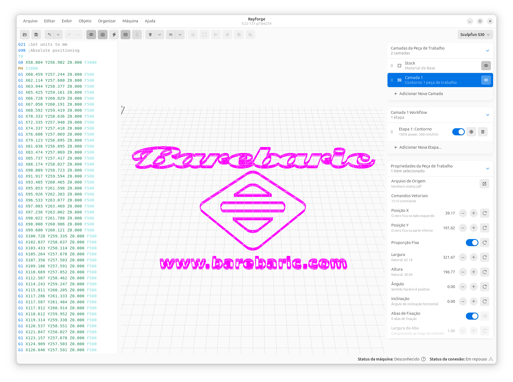

# Installation

Rayforge is available for Linux and Windows. Choose your platform below and follow the installation instructions.

## :fontawesome-brands-linux: Linux

Rayforge offers several installation methods for Linux users. Choose the one that best fits your distribution.

### Ubuntu & Derivatives (Recommended)

For Ubuntu 24.04 LTS and newer, as well as derivatives like Linux Mint and Pop!_OS, we recommend using our official PPA. This method provides automatic updates through your system's package manager.

```bash
sudo add-apt-repository ppa:knipknap/rayforge
sudo apt update
sudo apt install rayforge
```

Once installed, launch Rayforge from your application menu or by running `rayforge` in a terminal.

### Snap Package (Cross-Distribution)

The Snap package works on most Linux distributions and includes all dependencies in a sandboxed environment.

[](https://snapcraft.io/rayforge)

Or install from the command line:

```bash
sudo snap install rayforge
```

!!! warning "Permissions Required"
    The Snap version runs in a sandbox and requires manual permission grants for hardware access.

#### Granting Permissions

**For Camera Access:**
```bash
sudo snap connect rayforge:camera
```

**For USB Serial Port Access:**
```bash
# Enable experimental hotplug support (one-time setup)
sudo snap set system experimental.hotplug=true

# Connect your laser via USB, then grant access
sudo snap connect rayforge:serial-port
```

See [Snap Permissions Troubleshooting](../troubleshooting/snap-permissions.md) for more details.

### From Source (Advanced)

For developers and advanced users who want to run the latest development version or contribute to the project.

**Requirements:**

- Python 3.11 or newer
- System dependencies for GTK4 and GObject Introspection

**Installation on Debian/Ubuntu:**

```bash
# Install system dependencies
sudo apt update
sudo apt install python3-pip python3-gi gir1.2-gtk-3.0 gir1.2-adw-1 \
  gir1.2-gdkpixbuf-2.0 libgirepository-1.0-dev libgirepository-2.0-0 \
  libvips42t64 libadwaita-1-0 libopencv-dev

# Install Rayforge from PyPI
pip3 install rayforge
```

!!! note
    Package names may differ on other distributions. Refer to your distribution's documentation.

---

## :fontawesome-brands-windows: Windows

Download the latest installer from the **[Releases Page](https://github.com/barebaric/rayforge/releases/)**.

1. Download `rayforge-x.x.x-installer.exe`
2. Run the installer and follow the on-screen instructions
3. Launch Rayforge from the Start Menu or Desktop shortcut

---

## :fontawesome-brands-apple: macOS

There are currently no official macOS builds. However, Rayforge may run from source using the pip installation method. Community contributions for macOS packaging are welcome!

---

## Verifying Installation

After installation, verify that Rayforge is working:

1. Launch Rayforge from your application menu or terminal
2. You should see the main window with the canvas and toolbar
3. Check **Help → About** to confirm the installed version



---

## Next Steps

Now that Rayforge is installed, proceed to [First Time Setup](first-time-setup.md) to configure your machine.

## Troubleshooting

If you encounter issues during installation:

- **Linux PPA**: Ensure you're running Ubuntu 24.04 or newer
- **Snap permissions**: See [Snap Permissions Guide](../troubleshooting/snap-permissions.md)
- **Windows**: Run the installer as Administrator if you encounter permission errors
- **From source**: Ensure all system dependencies are installed

For additional help, visit the [Troubleshooting](../troubleshooting/index.md) section or report an issue on [GitHub](https://github.com/barebaric/rayforge/issues).
