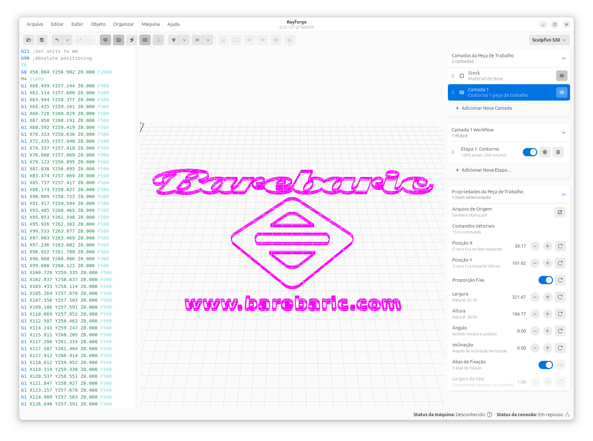

# Quick Start Guide

Now that Rayforge is installed and your machine is configured, let's run your first laser job! This guide will walk you through importing a design, configuring operations, and sending G-code to your machine.

## Workflow Overview

## Step 1: Import a Design

Rayforge supports various file formats including SVG, DXF, PDF, and raster images (JPEG, PNG, BMP).

1. **Click** **File → Open** or press ++ctrl+o++
2. Navigate to your design file and select it
3. The design will appear on the canvas

!!! tip "Don't have a design yet?"
    You can create simple shapes using the canvas tools or download free SVG files from sites like [Flaticon](https://www.flaticon.com/) or [SVG Repo](https://www.svgrepo.com/).

## Step 2: Position Your Design

Use the canvas tools to position and adjust your design:

- **Pan**: Middle-click and drag, or hold ++space++ and drag
- **Zoom**: Scroll wheel, or ++ctrl+"+"++ / ++ctrl+"-"++
- **Move**: Click and drag your design
- **Rotate**: Select the design and use the rotation handles
- **Scale**: Select the design and drag the corner handles

## Step 3: Assign an Operation

Operations define how Rayforge will process your design. Common operations include:

- **Contour**: Cut along the outline of shapes
- **Raster Engrave**: Fill shapes with back-and-forth lines (for engraving)
- **Depth Engrave**: Create 3D depth effects from images

### Adding an Operation

1. Select your design on the canvas
2. Click **Operations → Add Operation** or press ++ctrl+shift+a++
3. Choose the operation type (e.g., "Contour" for cutting)
4. Configure the operation settings:
   - **Power**: Laser power percentage (start low and test!)
   - **Speed**: Movement speed in mm/min
   - **Passes**: Number of times to repeat the operation (useful for cutting thick materials)

!!! warning "Start with Low Power"
    When working with new materials, always start with lower power settings and run test cuts. Gradually increase power until you achieve the desired result.

### Material Testing Recommendations

| Material | Power (%) | Speed (mm/min) | Passes |
|----------|-----------|----------------|--------|
| Paper    | 10-20     | 3000-5000      | 1      |
| Cardboard| 30-50     | 1500-3000      | 1-2    |
| Plywood (3mm) | 60-80 | 300-600       | 1-3    |
| Acrylic (3mm) | 70-90 | 200-400       | 1-2    |

*These are starting points only. Always test with your specific machine and materials.*

## Step 4: Preview G-code

Before sending to your machine, preview the toolpath in 3D:

1. Click **View → 3D Preview** or press ++ctrl+3++
2. The 3D preview window shows the complete toolpath
3. Use your mouse to rotate and zoom the preview
4. Verify that the path looks correct

!!! tip "Catch Errors Early"
    The 3D preview helps you spot issues like:

    - Missing paths
    - Incorrect ordering
    - Operations applied to the wrong objects
    - Paths that exceed your working area

## Step 5: Generate G-code

1. Click **Machine → Generate G-code** or press ++ctrl+g++
2. Rayforge will process your operations and generate the G-code
3. The generated code appears in the G-code viewer

## Step 6: Send to Machine

!!! danger "Safety First"
    - Ensure the work area is clear
    - Never leave the machine unattended during operation
    - Have fire safety equipment nearby
    - Wear appropriate eye protection

### Preparing Your Material

1. Place your material on the laser bed
2. Focus the laser according to your machine's instructions
3. If using the camera, align your design using the [camera overlay](../features/camera.md)

### Starting the Job

1. **Position the laser**: Use the jog controls to move the laser to the starting position
   - Click **Machine → Jog Controls** or press ++ctrl+j++
   - Use the arrow buttons or keyboard arrows to move the laser
   - Press ++home++ to home the machine

2. **Frame the design**: Run the framing function to verify placement
   - Click **Machine → Frame Job** or press ++ctrl+f++
   - The laser will trace the bounding box of your design at low/no power
   - Verify it fits within your material

3. **Start the job**: Click **Machine → Start Job** or press ++ctrl+r++
4. Monitor the progress in the status bar

### During the Job

- The status bar shows the current progress and estimated time remaining
- You can pause the job with ++ctrl+p++ or click the Pause button
- Press ++esc++ or click Stop to cancel the job (emergency stop)

## Step 7: Finishing Up

Once the job completes:

1. Wait for the exhaust fan to clear any fumes
2. Carefully remove your finished piece
3. Clean the laser bed if necessary

!!! success "Congratulations!"
    You've completed your first Rayforge job! Now you can explore more advanced features.

## Next Steps

Now that you've completed your first job, explore these features:

- **[Multi-Layer Operations](../features/multi-layer.md)**: Assign different operations to layers
- **[Holding Tabs](../features/holding-tabs.md)**: Keep cut pieces in place during cutting
- **[Camera Integration](../features/camera.md)**: Use a camera for precise alignment
- **[G-code Macros](../features/macros-hooks.md)**: Automate repetitive tasks

## Tips for Success

1. **Save your work**: Use ++ctrl+s++ to save your project frequently
2. **Test cuts**: Always run a test cut on scrap material first
3. **Material database**: Keep notes on successful power/speed settings for different materials
4. **Maintenance**: Keep your laser lens clean and check belt tension regularly
5. **Air assist**: If your machine has air assist, use it to prevent charring and improve cut quality

---

**Need Help?** Check the [Troubleshooting](../troubleshooting/index.md) section or visit the [GitHub Issues](https://github.com/barebaric/rayforge/issues) page.
