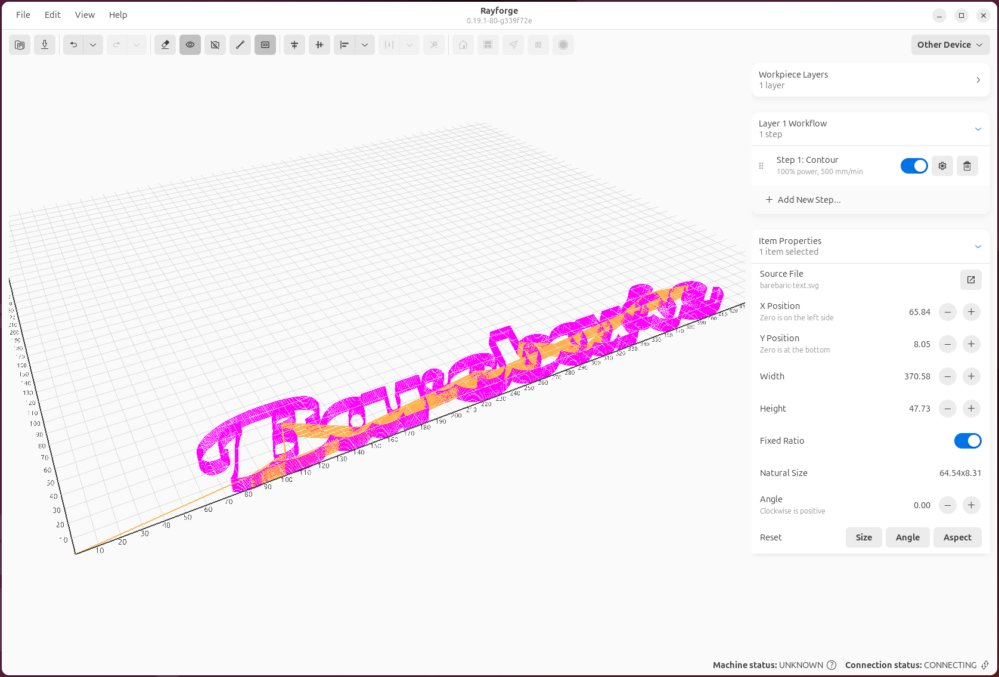

# 3D Preview

The 3D preview window lets you visualize your G-code toolpaths before sending them to your machine. This powerful feature helps you catch errors and verify your job setup.

## Opening 3D Preview

Access the 3D preview:

- **Menu**: View → 3D Preview
- **Keyboard**: ++ctrl+3++
- **After G-code generation**: Automatically opens (configurable)

## Navigation

### Mouse Controls

- **Rotate**: Left-click and drag
- **Pan**: Right-click and drag, or middle-click and drag
- **Zoom**: Scroll wheel, or ++ctrl++ + left-click and drag

### Keyboard Controls

- ++r++: Reset camera to default view
- ++home++: Reset zoom and position
- ++f++: Fit view to toolpath
- Arrow keys: Rotate camera

### View Presets

Quick camera angles:

- **Top** (++1++): Bird's eye view
- **Front** (++2++): Front elevation
- **Right** (++3++): Right side elevation
- **Isometric** (++4++): 3D isometric view

## Display Options

### Toolpath Visualization

Customize what you see:

- **Show Rapid Moves**: Display travel moves (dotted lines)
- **Show Work Moves**: Display cutting/engraving moves (solid lines)
- **Color by Operation**: Different colors for each operation
- **Color by Power**: Gradient based on laser power
- **Color by Speed**: Gradient based on feed rate

### Machine Visualization

- **Show Origin**: Display (0,0) reference point
- **Show Work Area**: Display machine boundaries
- **Show Laser Head**: Display current position indicator

### Quality Settings

- **Line Width**: Thickness of toolpath lines
- **Anti-aliasing**: Smooth line rendering (may impact performance)
- **Background**: Light, dark, or custom color

## Playback Controls

Simulate job execution:

- **Play/Pause** (++space++): Animate toolpath execution
- **Speed**: Adjust playback speed (0.5x - 10x)
- **Step Forward/Back**: Advance by individual G-code commands
- **Jump to Position**: Click timeline to jump to specific point

### Timeline

The timeline shows:

- Current position in job
- Operation boundaries (colored segments)
- Estimated time at any point

## Analysis Tools

### Distance Measurement

Measure distances in 3D:

1. Enable measurement tool
2. Click two points on toolpath
3. View distance in current units

### Statistics Panel

View job statistics:

- **Total Distance**: Sum of all moves
- **Work Distance**: Cutting/engraving distance only
- **Rapid Distance**: Travel moves only
- **Estimated Time**: Job duration estimate
- **Bounding Box**: Overall dimensions

### Layer Visibility

Toggle visibility of operations:

- Click operation name to show/hide
- Focus on specific operations for inspection
- Isolate problems without regenerating G-code

## Verification Checklist

Before sending to machine, verify:

- [ ] **Toolpath is complete**: No missing segments
- [ ] **Within work area**: Stays inside machine boundaries
- [ ] **Correct operation order**: Engrave before cut
- [ ] **No collisions**: Head doesn't hit clamps/fixtures
- [ ] **Proper origin**: Starts at expected position
- [ ] **Tab positions**: Holding tabs in correct locations (if used)

## Performance Tips

For large or complex jobs:

1. **Reduce line detail**: Lower display quality for faster rendering
2. **Hide rapid moves**: Focus on work moves only
3. **Disable anti-aliasing**: Improves framerate
4. **Close other applications**: Free up GPU resources

## Troubleshooting

### Preview is blank or black

- Regenerate G-code (++ctrl+g++)
- Check that operations are enabled
- Verify objects have operations assigned

### Slow or laggy preview

- Reduce line width
- Disable anti-aliasing
- Hide rapid moves
- Update graphics drivers

### Colors not showing correctly

- Check color by setting (operation/power/speed)
- Ensure operations have different colors assigned
- Reset view settings to defaults

---

**Next**: [Settings & Preferences →](settings.md)
