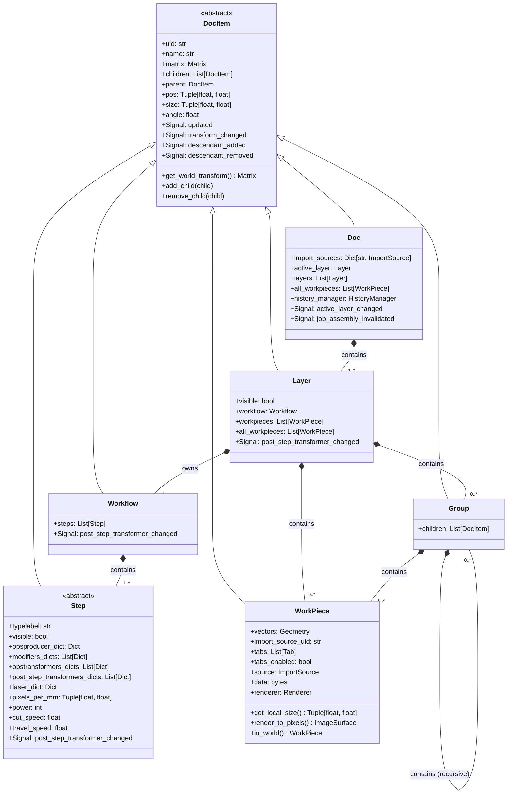
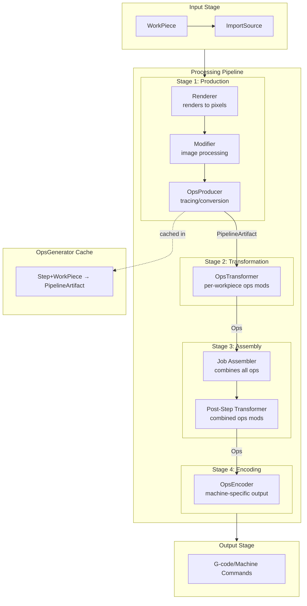
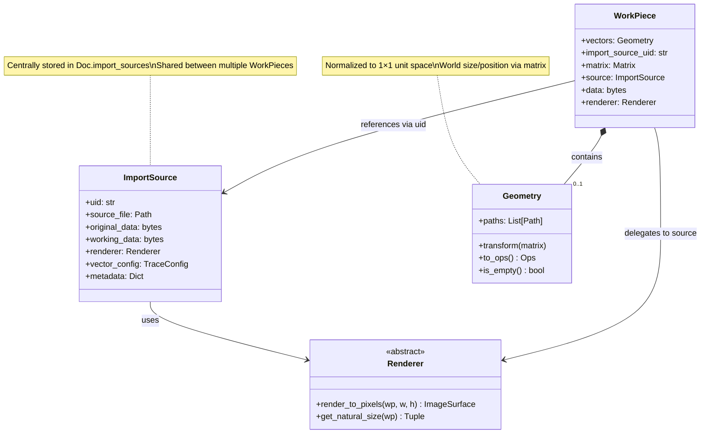
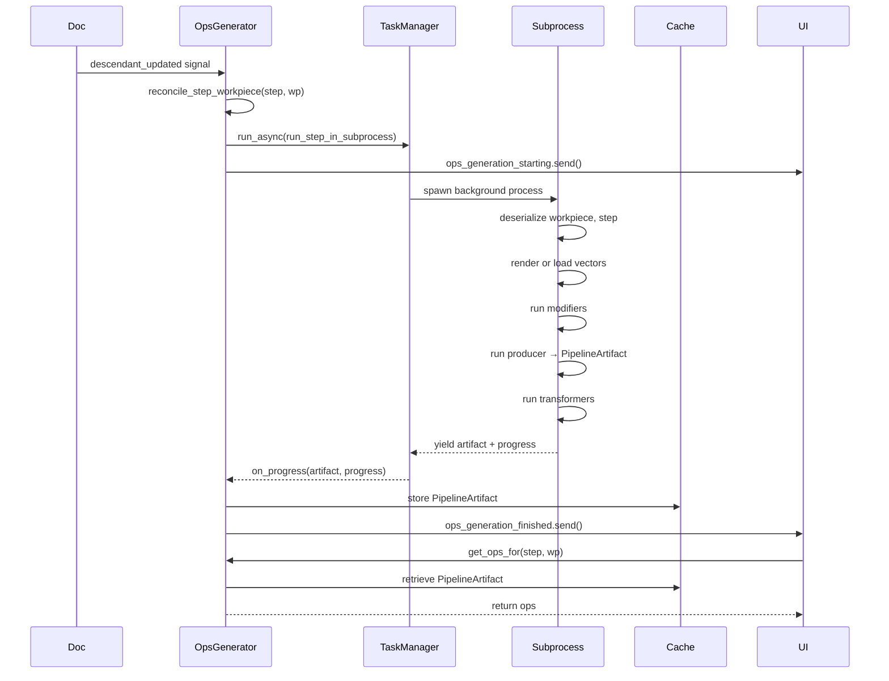

# Rayforge Architecture 

This document provides an architectural overview of Rayforge's core data model and pipeline architecture, explaining how the major components relate to each other.

## Table of Contents

- [Code Architecture](#code-architecture)
- [Document Hierarchy](#document-hierarchy)
- [The Pipeline Architecture](#the-pipeline-architecture)
- [Object Relationships](#object-relationships)
- [Key Design Patterns](#key-design-patterns)

---

## Code Architecture

Rayforge is a GTK4/Libadwaita-based desktop application for laser cutter control, built with a modular, pipeline-driven architecture:

### Core Architecture Components

- **`rayforge/core/`**: Document model and geometry handling
  - `doc.py`: Main document structure with layers and operations
  - `ops/`: Operation definitions (contour, raster, etc.)
  - `geo/`: Geometric primitives and transformations
  - `group.py`, `layer.py`: Document organization

- **`rayforge/pipeline/`**: Processing pipeline architecture
  - `producer/`: Converts input formats to geometry
  - `transformer/`: Modifies geometry (offsets, transforms, etc.)
  - `modifier/`: Advanced geometry modifications
  - `encoder/`: Converts to output formats (G-code, etc.)

- **`rayforge/machine/`**: Hardware interface layer
  - `driver/`: Device communication protocols
  - `transport/`: Low-level communication (serial, network, etc.)
  - `models/`: Machine configuration and profiles

- **`rayforge/doceditor/`**: Document editing interface
  - `editor.py`: Main document editor controller
  - `ui/`: Document-specific UI components

- **`rayforge/workbench/`**: Canvas and visualization
  - `surface.py`: 2D drawing surface
  - `canvas3d/`: 3D G-code preview system
  - `elements/`: Canvas drawable elements

- **`rayforge/image/`**: File format importers
  - Each subdirectory handles a specific format (svg, pdf, dxf, etc.)

### Key Design Patterns

1. **Pipeline Processing**: Jobs flow through producer → transformer → modifier → encoder stages
2. **Driver Architecture**: Composable transport + encoder for different machines
3. **Document Model**: Hierarchical structure with layers containing operations
4. **Async Task Management**: Background processing via `rayforge.shared.tasker`
5. **Configuration Management**: Centralized config in `rayforge.config`


## Document Hierarchy

Rayforge uses a hierarchical **Composite Pattern** to organize all document elements. At the root is the `Doc` object, which contains layers, which contain workpieces and groups.

### Class Diagram: Document Structure



### Key Concepts

1. **`DocItem`** ([item.py](../rayforge/core/item.py)): The abstract base class for all document elements
   - Implements the Composite pattern for tree management
   - Provides hierarchical transformation via `matrix` property
   - Automatically bubbles signals up the tree (updated, transform_changed, descendant_added/removed)
   - Position, size, and rotation are computed properties derived from the transformation matrix

2. **`Doc`** ([doc.py](../rayforge/core/doc.py)): The root document object
   - Contains multiple `Layer` objects
   - Manages `ImportSource` registry (shared source files/data)
   - Tracks the active layer
   - Provides undo/redo via `HistoryManager`

3. **`Layer`** ([layer.py](../rayforge/core/layer.py)): Organizes workpieces with a common processing workflow
   - Contains `WorkPiece` objects (and optionally `Group` objects for organization)
   - Owns exactly one `Workflow` object
   - Can be shown/hidden via `visible` property

4. **`Workflow`** ([workflow.py](../rayforge/core/workflow.py)): An ordered sequence of processing steps
   - Contains `Step` objects that define how to process workpieces
   - Steps are executed in order to generate machine operations

5. **`Step`** ([step.py](../rayforge/core/step.py)): A stateless configuration for a processing operation
   - Defines which `OpsProducer` to use (e.g., outline, engrave, raster)
   - Stores configuration as serializable dictionaries
   - Holds laser parameters (power, speed, air assist)
   - Each step type corresponds to a different operation (cut, engrave, etc.)

6. **`WorkPiece`** ([workpiece.py](../rayforge/core/workpiece.py)): Represents a physical object to be processed
   - Contains vector geometry (`Geometry`) normalized to a 1×1 unit reference box
   - Links to an `ImportSource` for raster rendering (optional)
   - World-space size/position is determined by its transformation matrix
   - Can be dragged, rotated, and scaled on the canvas

7. **`Group`** ([group.py](../rayforge/core/group.py)): A container for organizing multiple workpieces
   - Allows hierarchical organization
   - Transformations apply to all children

---

## The Pipeline Architecture

Rayforge uses a **pipeline architecture** to convert workpieces into machine operations. The pipeline consists of four main stages: **Producer → Modifier → Transformer → Encoder**.

### Pipeline Flow Diagram



### Pipeline Components

#### 1. **OpsProducer** ([producer/base.py](../rayforge/pipeline/producer/base.py))

Converts source data (raster images or vectors) into machine operations (`Ops`).

**Key Producers:**
- `OutlineProducer`: Traces vector outlines from SVG/DXF geometry
- `RasterizeProducer`: Converts images to scan lines for engraving
- `EdgeProducer`: Traces bitmap edges using Potrace
- `DepthProducer`: Creates 3D depth maps
- `FrameProducer`: Creates rectangular frames around content

**Key Concept:** Producers return a `PipelineArtifact`, not just raw `Ops`.

#### 2. **PipelineArtifact** ([producer/base.py](../rayforge/pipeline/producer/base.py))

A self-describing container for generated operations.

```python
@dataclass
class PipelineArtifact:
    ops: Ops                                      # The generated operations
    is_scalable: bool                             # Can ops be mathematically scaled?
    source_coordinate_system: CoordinateSystem    # Pixel, millimeter, or natural space
    source_dimensions: Optional[Tuple[float, float]]  # Canvas size in source units
    generation_size: Optional[Tuple[float, float]]    # Physical size when generated
```

**Purpose:**
- Scalable artifacts (vectors) can be quickly scaled without regeneration
- Non-scalable artifacts (raster) must be regenerated on resize
- Coordinate system metadata enables proper transformation

#### 3. **Modifier** ([modifier/base.py](../rayforge/pipeline/modifier/base.py))

Pre-processes raster images before they reach the producer.

**Examples:**
- `ToGrayscale`: Converts color images to grayscale
- `Invert`: Inverts image colors
- `Threshold`: Applies binary thresholding
- `Dither`: Applies dithering algorithms

#### 4. **OpsTransformer** ([transformer/base.py](../rayforge/pipeline/transformer/base.py))

Modifies generated operations for a single workpiece.

**Examples:**
- `ScaleTransformer`: Scales ops to target size
- `OffsetTransformer`: Applies geometric offset (inward/outward)
- `ClipTransformer`: Clips ops to machine bounds
- `SmoothTransformer`: Smooths path corners

#### 5. **Post-Step Transformer**

Applied to the combined ops of all workpieces in a step (after assembly).

**Examples:**
- `OptimizePathTransformer`: Reorders paths to minimize travel time
- `TabsTransformer`: Adds holding tabs to prevent parts from moving

#### 6. **OpsEncoder** ([encoder/base.py](../rayforge/pipeline/encoder/base.py))

Converts ops into machine-specific output format.

**Examples:**
- `GCodeEncoder`: Generates standard G-code
- `RuidaEncoder`: Generates Ruida controller commands
- `GRBLEncoder`: Generates GRBL-specific G-code

### OpsGenerator: The Orchestrator

The `OpsGenerator` ([generator.py](../rayforge/pipeline/generator.py)) is the central coordinator:

1. **Listens** to document changes via signals
2. **Determines** what needs regeneration (which Step+WorkPiece pairs changed)
3. **Spawns** background tasks via `TaskManager` to run the pipeline in subprocesses
4. **Caches** `PipelineArtifact` objects for quick retrieval
5. **Emits** signals when generation starts, progresses, and completes

**Key Signals:**
- `ops_generation_starting`: Fired before generation begins
- `ops_chunk_available`: Fired as raster chunks become available
- `ops_generation_finished`: Fired when generation completes

**Cache Structure:**
```python
OpsCacheType = Dict[Tuple[step_uid, workpiece_uid], Optional[PipelineArtifact]]
```

---

## Object Relationships

### Workpiece and ImportSource



**Key Insights:**

1. **Separation of Data and Display**
   - `ImportSource`: Stores raw file data and rendering strategy
   - `WorkPiece`: Stores vector geometry and transformation
   - Multiple workpieces can share one `ImportSource`

2. **Renderer Pattern**
   - Each file type has a corresponding `Renderer` (SVGRenderer, PDFRenderer, etc.)
   - Handles rasterization at any resolution
   - Examples: `SVGRenderer`, `PDFRenderer`, `ImageRenderer`

3. **Normalized Geometry**
   - `WorkPiece.vectors` is always normalized to a 1×1 unit reference box
   - World-space size/position/rotation is computed from `matrix`
   - This separation prevents rendering errors and simplifies transformations

### Step Execution and Caching



**Key Insights:**

1. **Async Background Processing**
   - Heavy work (rendering, tracing) runs in subprocesses via `TaskManager`
   - Main thread remains responsive
   - Progress updates sent incrementally

2. **Smart Caching**
   - Results cached by `(step_uid, workpiece_uid)` key
   - Scalable artifacts (vectors) can be scaled without regeneration
   - Non-scalable artifacts (raster) require regeneration on size change

3. **Signal-Driven Architecture**
   - Document changes trigger signals
   - OpsGenerator listens and reconciles what needs regeneration
   - UI listens to OpsGenerator signals to update views

---

## Key Design Patterns

### 1. Composite Pattern (Document Tree)

All document elements inherit from `DocItem`, allowing them to be composed into a tree structure. Each node can have children, and transformations propagate down the tree.

**Benefits:**
- Uniform interface for all document elements
- Hierarchical transformations (groups, nested items)
- Automatic signal bubbling

### 2. Signal-Based Communication (Observer Pattern)

Rayforge uses the `blinker` library for signals. Components emit signals when they change, and other components listen and react.

**Key Signals:**
- `updated`: Item's data changed
- `transform_changed`: Item's matrix changed
- `descendant_added/removed`: Tree structure changed
- `ops_generation_finished`: Background generation completed

**Benefits:**
- Loose coupling between components
- Multiple listeners can react to the same event
- Easy to add new features without modifying existing code

### 3. Strategy Pattern (Pipeline Components)

Each pipeline stage (Producer, Modifier, Transformer, Encoder) is an abstract base class with concrete implementations. These are stored as dictionaries and instantiated on demand.

**Benefits:**
- Extensible architecture
- Easy to add new operations
- Configuration is serializable

### 4. Flyweight Pattern (ImportSource Sharing)

Multiple `WorkPiece` objects can reference the same `ImportSource` by UID. The raw file data is stored once in `Doc.import_sources`.

**Benefits:**
- Memory efficiency (one copy of large image files)
- Consistent rendering across duplicate workpieces
- Easy to update source for all instances

### 5. Command Pattern (Ops and Commands)

Machine operations are represented as a sequence of `Command` objects in an `Ops` container. Each command encapsulates a specific instruction.

**Command Types:**
- Movement: `MoveToCommand`, `LineToCommand`, `ArcToCommand`
- Settings: `SetPowerCommand`, `SetCutSpeedCommand`
- Control: `JobStartCommand`, `LayerStartCommand`, `OpsSectionStartCommand`

**Benefits:**
- Easy to serialize/deserialize
- Can be inspected, modified, and optimized
- Machine-independent representation

---

## Summary

Rayforge's architecture is built around several core concepts:

1. **Hierarchical Document Model** - Everything is a `DocItem` in a tree structure
2. **Pipeline Processing** - WorkPieces flow through Producer → Transformer → Encoder stages
3. **Async Generation** - Heavy processing runs in background subprocesses
4. **Smart Caching** - `OpsGenerator` caches `PipelineArtifact` objects for fast retrieval
5. **Signal-Driven Updates** - Components communicate via signals for loose coupling
6. **Normalized Geometry** - Vectors are stored in 1×1 space, transformed via matrices

This architecture provides:
- **Extensibility**: Easy to add new file formats, operations, and machines
- **Performance**: Background processing and caching keep the UI responsive
- **Flexibility**: Pipeline components can be mixed and matched
- **Maintainability**: Clear separation of concerns and loose coupling