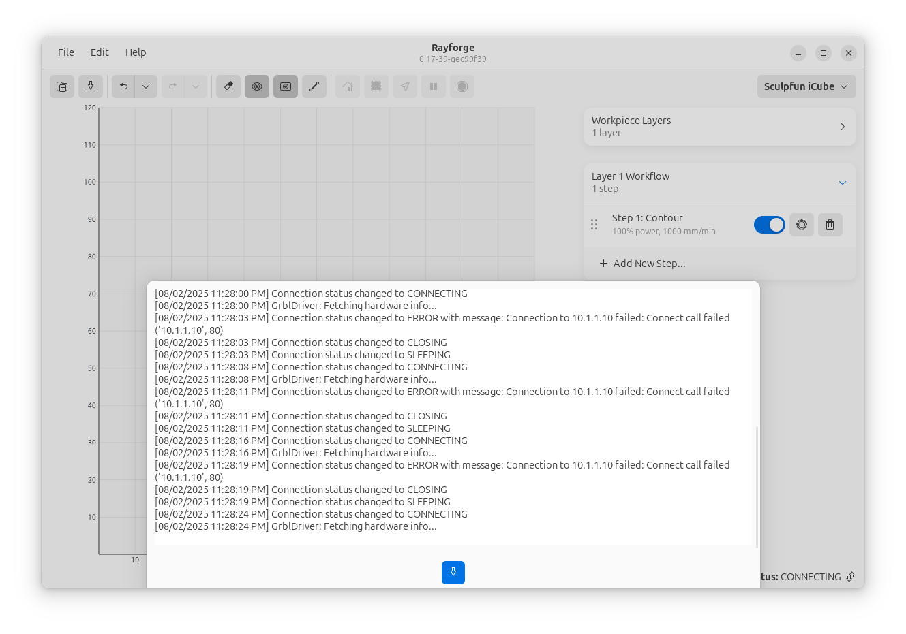

# Troubleshooting & Reporting Issues

If you're experiencing problems with Rayforge, especially with connecting to or controlling your machine, we're here to help. The best way to get support is by providing a detailed debug report. Rayforge has a built-in tool that makes this easy.

## How to Create a Debug Report

Follow these simple steps to generate and share a report:

#### 1. Open the Log Viewer

At the bottom of the main window, you'll find the status bar. It shows the current connection status (e.g., "Connected", "Disconnected"). **Click on this status bar** to open the Log Viewer panel.

#### 2. Save the Report

In the Log Viewer panel, click the **Save** button. This will package all the necessary diagnostic information into a single `.zip` file. Save this file to a memorable location, like your Desktop.

#### 3. Create a GitHub Issue

Go to our [GitHub Issues page](https://github.com/barebaric/rayforge/issues/new/choose) and create a new issue. Please provide a clear title and a detailed description of the problem:

*   **What did you do?** (e.g., "I tried to connect to my laser after starting the app.")
*   **What did you expect to happen?** (e.g., "I expected it to connect successfully.")
*   **What actually happened?** (e.g., "It stayed disconnected and the log showed timeout errors.")

#### 4. Attach the Report

**Drag and drop the `.zip` file** you saved into the description box of the GitHub issue. This will upload and attach it to your report.

## What's in the Debug Report?

The generated `.zip` file contains technical information that helps us diagnose the problem quickly. It includes:

*   **Machine & Application Settings:** Your saved machine configurations and application preferences, which helps us reproduce your setup.
*   **Communication Logs:** A detailed record of the data sent between Rayforge and your laser.
*   **System Information:** Your operating system and the versions of Rayforge and key libraries installed.
*   **Application State:** Other internal information that can help pinpoint the source of an error.

> **Privacy Note:** The report **does not** include any of your design files (SVGs, DXFs, etc.) or personal operating system data. It only contains information directly related to the Rayforge application and its connection to your laser.

Thank you for helping us improve Rayforge
