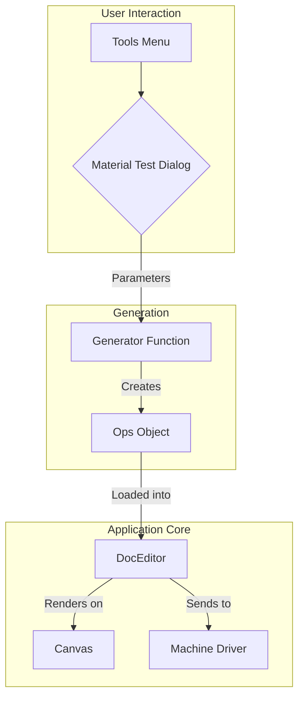

# Material Test Generator

This document outlines the specification for the Material Test Generator tool in Rayforge. This tool is designed to help users quickly and safely determine the optimal speed and power settings for cutting or engraving a new material.

## Overview

The Material Test Generator creates a grid of shapes on the workspace. Each shape in the grid is assigned a unique combination of laser speed and power. By running this job and observing the results, the user can visually identify the best settings for their specific material and laser.

The core of this feature is a self-contained "Ops generator" that plugs into the existing Rayforge architecture without requiring modifications to machine drivers or G-code encoders.

## User Interface

The feature is accessed via a new menu item: **Tools -> Material Test Generator…**. This opens the "Material Test Generator" dialog window where the user configures the test grid.

The dialog contains the following settings:

### Presets
-   **Test Type**: A dropdown to select either "Engrave" or "Cut". This choice adjusts the default speed/power ranges.
-   **Laser Type**: A dropdown to select "Diode" or "CO2". This loads sensible starting parameters for the selected laser technology.

### Parameters
-   **Speed Range (mm/min)**: The minimum and maximum speed for the test grid.
-   **Power Range (%)**: The minimum and maximum power for the test grid.
-   **Grid Dimensions**: Two spinboxes to define the number of columns (speed steps) and rows (power steps).
-   **Shape Size (mm)**: The size of the individual test shapes (e.g., 10mm for a 10x10mm square).
-   **Spacing (mm)**: The distance between each test shape.
-   **Line Interval (mm)**: For "Engrave" tests, this defines the spacing between raster lines within each shape.
-   **Include Labels**: A checkbox to enable or disable the generation of text labels (e.g., "S:500 P:20") next to each test shape.

### Actions
-   **Cancel**: Closes the dialog without making changes.
-   **Generate**: Creates the test grid, closes the dialog, and loads the new job into the main workspace.

## Generation Logic

When the user clicks "Generate", the following occurs:

1.  The dialog collects all user-defined parameters.
2.  It calls a generator function (e.g., `generate_material_test_ops`) with these parameters.
3.  This function programmatically creates an `Ops` object representing the entire test grid.

### Ops Generation Strategy

The `generate_material_test_ops` function will directly construct the `Ops` object. This approach avoids the overhead and complexity of rasterizing the entire test pattern to an image and then tracing it back to vectors.

*   **For Rectangles**: The `Ops` for the test squares will be generated mathematically using basic `move_to` and `line_to` commands.
*   **For Text Labels**: To handle the complexity of font rendering, Cairo's `text_path()` function will be utilized. This function converts text into a vector path outline. The generator will then iterate over these path segments and translate them into corresponding `Ops` commands (`move_to`, `line_to`, `curve_to`).

### Critical Feature: Risk-Optimized Execution Order

A key design requirement is to execute the test shapes in an order that minimizes the risk of charring the material, which could ruin adjacent, less-intense test areas. The generator **must** order the operations from lowest risk to highest risk.

The sorting criteria are as follows:
1.  **Speed**: Descending (highest speed is lowest risk).
2.  **Power**: Ascending (lowest power is lowest risk).

For example, a test at `Speed: 5000, Power: 10` will run before a test at `Speed: 4000, Power: 10`, which will in turn run before a test at `Speed: 4000, Power: 20`.

While the *execution* order is optimized for safety, the *visual layout* of the grid on the canvas must remain intuitive (e.g., speed increasing from left to right, power increasing from top to bottom). The generator function is responsible for mapping the sorted execution order back to the correct visual grid positions.

### Label Generation

If "Include Labels" is checked, the generator will also create vector text objects for each grid cell.
-   The text should indicate the speed and power for that cell (e.g., "S:1000 P:20").
-   The text itself will be generated as vector `Ops` using Cairo's `text_path()` as described above. These label `Ops` will be added to the overall `Ops` object before the test squares, ensuring they are processed first.

## Integration with `DocEditor`

The `MaterialTestDialog` emits a signal (`ops_generated`) containing the newly created `Ops` object. The `MainWindow` listens for this signal and performs the following actions:

1.  Receives the `Ops` object.
2.  Calls a method on the `DocEditor` (e.g., `load_ops_as_new_document`).
3.  This method clears the current document of all existing items.
4.  It then creates a new `WorkPiece` from the generated `Ops` and adds it to a new layer named "Material Test".

The result is that the user's workspace is replaced with the new test grid, ready to be positioned on the canvas and sent to the machine.
