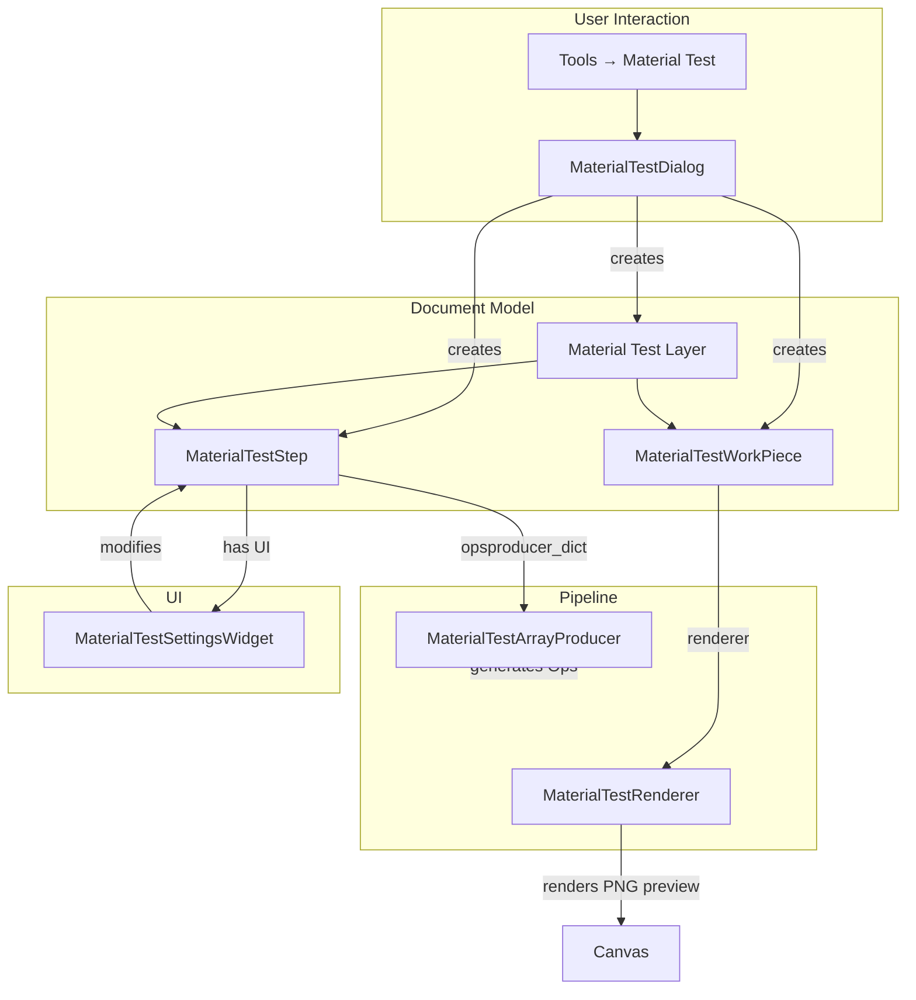

# Material Test Array Refactoring Proposal

This document explores a refactoring of the Material Test Generator to integrate it more deeply into Rayforge's pipeline architecture.

## Current Implementation (v1)

The current implementation ([material_test.md](material_test.md)) uses a simpler approach:


**Pros:**
- ✅ Simple, direct implementation
- ✅ No new infrastructure needed
- ✅ Easy to understand and maintain
- ✅ Already working (as implemented)

**Cons:**
- ❌ Not integrated with pipeline architecture
- ❌ Ops contain embedded speed/power values that bypass the layer's workflow
- ❌ No way to regenerate if parameters change
- ❌ No specialized UI in step settings
- ❌ Risk-sorted execution order is "baked in" and can't be easily modified

---

## Proposed Refactoring (v2)

Integrate the material test as a first-class pipeline component with a specialized producer, step type, and workpiece renderer.

### Architecture Overview



### Component Design

#### 1. MaterialTestArrayProducer

**Location:** `rayforge/pipeline/producer/material_test.py`

A producer that generates test grid ops from workpiece metadata (no actual rendering needed).

```python
class MaterialTestArrayProducer(OpsProducer):
    """
    Generates a material test grid with varying speed and power settings.

    Unlike typical producers, this one generates ops directly from parameters
    stored in the producer configuration, not from rendered pixel data.
    """

    def __init__(
        self,
        test_type: str = "Cut",           # "Cut" or "Engrave"
        speed_range: Tuple[float, float] = (100, 500),
        power_range: Tuple[float, float] = (10, 100),
        grid_dimensions: Tuple[int, int] = (5, 5),
        shape_size: float = 10.0,         # mm
        spacing: float = 2.0,             # mm
        include_labels: bool = True,
    ):
        super().__init__()
        self.test_type = test_type
        self.speed_range = speed_range
        self.power_range = power_range
        self.grid_dimensions = grid_dimensions
        self.shape_size = shape_size
        self.spacing = spacing
        self.include_labels = include_labels

    def run(
        self,
        laser,
        surface,  # Unused
        pixels_per_mm,  # Unused
        *,
        workpiece: Optional[WorkPiece] = None,
        y_offset_mm: float = 0.0,
    ) -> PipelineArtifact:
        """
        Generates the material test ops.

        The workpiece parameter is used only for its UID (for section marking).
        All parameters come from the producer's own configuration.
        """
        ops = self._generate_test_ops()

        # Calculate the total size of the grid
        cols, rows = self.grid_dimensions
        total_width = cols * (self.shape_size + self.spacing) - self.spacing
        total_height = rows * (self.shape_size + self.spacing) - self.spacing

        return PipelineArtifact(
            ops=ops,
            is_scalable=True,  # Can be scaled mathematically
            source_coordinate_system=CoordinateSystem.MILLIMETER_SPACE,
            source_dimensions=(total_width, total_height),
            generation_size=(total_width, total_height),
        )

    def _generate_test_ops(self) -> Ops:
        """Core generation logic (similar to current implementation)."""
        ops = Ops()
        # Generate labels first
        if self.include_labels:
            self._generate_labels(ops)

        # Generate test squares in risk-sorted order
        test_elements = self._create_test_grid()
        test_elements.sort(key=lambda e: (-e["speed"], e["power"]))

        for element in test_elements:
            ops.add(SetPowerCommand(element["power"]))
            ops.add(SetCutSpeedCommand(element["speed"]))
            self._draw_rectangle(ops, element["x"], element["y"],
                                element["width"], element["height"])

        return ops

    @property
    def requires_full_render(self) -> bool:
        return False  # No rendering needed

    def to_dict(self) -> dict:
        return {
            "type": self.__class__.__name__,
            "params": {
                "test_type": self.test_type,
                "speed_range": self.speed_range,
                "power_range": self.power_range,
                "grid_dimensions": self.grid_dimensions,
                "shape_size": self.shape_size,
                "spacing": self.spacing,
                "include_labels": self.include_labels,
            },
        }
```

#### 2. MaterialTestRenderer

**Location:** `rayforge/image/material_test_renderer.py`

A renderer that creates a preview image of what the test will look like.

```python
class MaterialTestRenderer(Renderer):
    """
    Renders a preview of the material test grid.

    This is used for canvas visualization only. The actual ops generation
    is handled by the MaterialTestArrayProducer.
    """

    def __init__(self, producer_params: Dict[str, Any]):
        """
        Initializes with parameters from the producer.

        Args:
            producer_params: The 'params' dict from MaterialTestArrayProducer
        """
        super().__init__()
        self.producer_params = producer_params

    def render_to_pixels(
        self,
        workpiece: WorkPiece,
        width: int,
        height: int,
    ) -> cairo.ImageSurface:
        """
        Renders a visualization of the test grid.

        Creates a PNG showing:
        - Grid squares with gradient shading (lighter = higher speed/lower power)
        - Speed/power labels
        - Axis labels
        """
        surface = cairo.ImageSurface(cairo.FORMAT_ARGB32, width, height)
        ctx = cairo.Context(surface)

        # White background
        ctx.set_source_rgb(1, 1, 1)
        ctx.paint()

        # Calculate scaling
        cols, rows = self.producer_params["grid_dimensions"]
        shape_size = self.producer_params["shape_size"]
        spacing = self.producer_params["spacing"]

        total_width = cols * (shape_size + spacing) - spacing
        total_height = rows * (shape_size + spacing) - spacing

        scale_x = width / total_width
        scale_y = height / total_height
        ctx.scale(scale_x, scale_y)

        # Draw grid squares with gradient shading
        speed_range = self.producer_params["speed_range"]
        power_range = self.producer_params["power_range"]

        min_speed, max_speed = speed_range
        min_power, max_power = power_range

        speed_step = (max_speed - min_speed) / (cols - 1) if cols > 1 else 0
        power_step = (max_power - min_power) / (rows - 1) if rows > 1 else 0

        for r in range(rows):
            for c in range(cols):
                current_speed = min_speed + c * speed_step
                current_power = min_power + r * power_step

                x = c * (shape_size + spacing)
                y = r * (shape_size + spacing)

                # Gradient: darker = more intense (slower speed, higher power)
                # Normalize speed (inverse) and power
                speed_factor = 1.0 - (current_speed - min_speed) / (max_speed - min_speed) if max_speed > min_speed else 0
                power_factor = (current_power - min_power) / (max_power - min_power) if max_power > min_power else 0
                intensity = (speed_factor + power_factor) / 2.0

                # Color: light gray to dark gray
                gray = 0.9 - (intensity * 0.6)
                ctx.set_source_rgb(gray, gray, gray)
                ctx.rectangle(x, y, shape_size, shape_size)
                ctx.fill()

                # Border
                ctx.set_source_rgb(0.3, 0.3, 0.3)
                ctx.set_line_width(0.2)
                ctx.rectangle(x, y, shape_size, shape_size)
                ctx.stroke()

        # Draw labels if enabled
        if self.producer_params.get("include_labels", True):
            self._draw_labels(ctx, cols, rows, speed_range, power_range,
                            shape_size, spacing)

        return surface

    def get_natural_size(self, workpiece: WorkPiece) -> Tuple[float, float]:
        """Returns the natural size of the test grid in mm."""
        cols, rows = self.producer_params["grid_dimensions"]
        shape_size = self.producer_params["shape_size"]
        spacing = self.producer_params["spacing"]

        width = cols * (shape_size + spacing) - spacing
        height = rows * (shape_size + spacing) - spacing

        return width, height
```

#### 3. MaterialTestWorkPiece

**Option A: Subclass WorkPiece**

```python
class MaterialTestWorkPiece(WorkPiece):
    """
    A specialized workpiece for material tests.

    The geometry and renderer are tightly coupled to the producer parameters.
    """

    def __init__(self, producer_params: Dict[str, Any], name: str = "Material Test"):
        # Create a renderer from producer params
        renderer = MaterialTestRenderer(producer_params)

        # Calculate natural size
        cols, rows = producer_params["grid_dimensions"]
        shape_size = producer_params["shape_size"]
        spacing = producer_params["spacing"]
        width = cols * (shape_size + spacing) - spacing
        height = rows * (shape_size + spacing) - spacing

        # Create dummy geometry (just a bounding box for selection)
        geo = Geometry()
        geo.move_to(0, 0)
        geo.line_to(width, 0)
        geo.line_to(width, height)
        geo.line_to(0, height)
        geo.close_path()

        super().__init__(name=name, vectors=geo)

        # Store the renderer directly (transient, not linked to ImportSource)
        self._renderer = renderer
        self._producer_params = producer_params
```

**Option B: Use Standard WorkPiece + Custom ImportSource**

Create a special `ImportSource` that stores the producer parameters:

```python
# In the dialog or creation code:
producer_params = {...}  # From dialog settings

# Create a synthetic ImportSource
import_source = ImportSource(
    source_file=Path("<material-test>"),
    original_data=json.dumps(producer_params).encode(),
    renderer=MaterialTestRenderer(producer_params),
    metadata={"type": "material_test"},
)

# Create standard WorkPiece
workpiece = WorkPiece(name="Material Test")
workpiece.import_source_uid = import_source.uid

# Add to document
doc.add_import_source(import_source)
```

#### 4. MaterialTestStep (Step Factory)

**Location:** `rayforge/pipeline/steps.py`

```python
def create_material_test_step(
    test_type: str = "Cut",
    speed_range: Tuple[float, float] = (100, 500),
    power_range: Tuple[float, float] = (10, 100),
    grid_dimensions: Tuple[int, int] = (5, 5),
    shape_size: float = 10.0,
    spacing: float = 2.0,
    include_labels: bool = True,
    name: Optional[str] = None,
) -> Step:
    """Factory to create a Material Test step."""
    assert config.config.machine

    step = Step(
        typelabel=_("Material Test Array"),
        name=name or _("Material Test"),
    )

    step.opsproducer_dict = MaterialTestArrayProducer(
        test_type=test_type,
        speed_range=speed_range,
        power_range=power_range,
        grid_dimensions=grid_dimensions,
        shape_size=shape_size,
        spacing=spacing,
        include_labels=include_labels,
    ).to_dict()

    # Material test doesn't need modifiers (no image processing)
    step.modifiers_dicts = []

    # No transformers needed - ops are already risk-sorted
    step.opstransformers_dicts = []

    # No post-step transformers - we don't want optimization or multipass
    step.post_step_transformers_dicts = []

    step.laser_dict = config.config.machine.heads[0].to_dict()
    step.max_cut_speed = config.config.machine.max_cut_speed
    step.max_travel_speed = config.config.machine.max_travel_speed

    return step
```

#### 5. MaterialTestSettingsWidget

**Location:** `rayforge/doceditor/ui/step_settings/material_test.py`

This widget would NOT inherit from `StepComponentSettingsWidget` because it needs full control over the step, not just a single component.

```python
class MaterialTestSettingsWidget(Adw.PreferencesGroup):
    """
    Custom settings UI for Material Test steps.

    Unlike typical step component widgets, this manages ALL aspects of the
    step because the material test is a complete, self-contained operation.
    """

    def __init__(
        self,
        step: Step,
        page: Adw.PreferencesPage,
        history_manager: HistoryManager,
        **kwargs,
    ):
        super().__init__(title=_("Material Test Configuration"), **kwargs)
        self.step = step
        self.page = page
        self.history_manager = history_manager

        # Get current producer params
        producer = MaterialTestArrayProducer.from_dict(step.opsproducer_dict)

        # Build UI
        self._build_preset_selector()
        self._build_range_controls(producer)
        self._build_grid_controls(producer)
        self._build_size_controls(producer)
        self._build_label_toggle(producer)

    def _build_preset_selector(self):
        """Preset dropdown (Diode Cut, CO2 Engrave, etc.)"""
        ...

    def _build_range_controls(self, producer):
        """Speed and power range spin buttons"""
        ...

    def _on_parameter_changed(self, param_name: str, new_value: Any):
        """
        Updates the producer dict and triggers regeneration.
        """
        params_dict = self.step.opsproducer_dict.setdefault("params", {})

        command = DictItemCommand(
            target_dict=params_dict,
            key=param_name,
            new_value=new_value,
            name=_(f"Change {param_name}"),
            on_change_callback=lambda: self.step.updated.send(self.step),
        )
        self.history_manager.execute(command)
```

**Registration in `__init__.py`:**

```python
# rayforge/doceditor/ui/step_settings/__init__.py
from .material_test import MaterialTestSettingsWidget

WIDGET_REGISTRY: Dict[str, Type[StepComponentSettingsWidget]] = {
    "MaterialTestArrayProducer": MaterialTestSettingsWidget,
    # ... other widgets
}
```

#### 6. MaterialTestDialog

The dialog becomes much simpler - it just creates the layer, step, and workpiece:

```python
class MaterialTestDialog(Adw.Window):
    """Simplified dialog that creates a material test setup."""

    def _on_generate(self, button):
        """Creates the layer + step + workpiece structure."""
        # 1. Gather parameters from UI
        params = self._gather_params()

        # 2. Create the step
        step = create_material_test_step(**params)

        # 3. Create a new layer
        layer = Layer(_("Material Test"))
        layer.workflow.add_step(step)

        # 4. Create the workpiece (with custom renderer)
        producer_params = step.opsproducer_dict["params"]
        import_source = ImportSource(
            source_file=Path("<material-test>"),
            original_data=json.dumps(producer_params).encode(),
            renderer=MaterialTestRenderer(producer_params),
            metadata={"type": "material_test"},
        )

        workpiece = WorkPiece(name=_("Material Test Grid"))
        workpiece.import_source_uid = import_source.uid

        # Set natural size from producer params
        width, height = MaterialTestRenderer(producer_params).get_natural_size(workpiece)
        workpiece.set_size(width, height)

        # 5. Add to document
        self.doc_editor.doc.add_import_source(import_source)
        self.doc_editor.doc.add_layer(layer)
        layer.add_child(workpiece)

        # 6. Position in center of workspace
        ws_width, ws_height = self.main_window.surface.get_size_mm()
        workpiece.pos = (ws_width / 2 - width / 2, ws_height / 2 - height / 2)

        self.close()
```

---

## Comparison: v1 vs v2

| Aspect | Current (v1) | Proposed (v2) |
|--------|--------------|---------------|
| **Complexity** | Low - Simple generator function | High - Full pipeline integration |
| **Pipeline Integration** | None - bypasses pipeline | Full - producer, renderer, step |
| **Parameter Editing** | Not possible after generation | Easy - edit in step settings panel |
| **Regeneration** | Manual - delete and recreate | Automatic - change params, regenerate |
| **Canvas Preview** | Geometry only | Rendered preview with gradient shading |
| **Speed/Power Control** | Embedded in ops, bypasses layer | Could use layer's settings (but shouldn't) |
| **Undo/Redo** | Only for workpiece transforms | Full support for parameter changes |
| **Code Lines** | ~200 (simple) | ~800-1000 (comprehensive) |
| **Learning Curve** | Low | High |
| **Extensibility** | Hard to extend | Easy to add new test patterns |

---

## Recommendations

### For Current Implementation (v1): ✅ Keep As-Is

The current approach is **appropriate** for this feature because:

1. **Material Test is a one-time operation** - Users don't typically need to regenerate or tweak parameters
2. **Speed/Power values SHOULD be embedded** - The test needs precise, varied values per square
3. **Simple is better** - Less code to maintain, easier to understand
4. **Risk-sorted execution IS the feature** - Baking it in is correct

### When v2 Would Make Sense:

The refactored approach would be justified if:

1. **Users frequently adjust test parameters** after generation
2. **Multiple test patterns** need to be supported (different shapes, layouts)
3. **Dynamic preview** is critical during parameter selection
4. **Test needs to scale** with workpiece size changes
5. **Integration with other pipeline features** is needed (e.g., apply modifiers to test grid)

### Hybrid Approach (Compromise):

If you want some benefits of v2 without full complexity:

1. **Keep the current generator** (`generate_material_test_ops`)
2. **Add a custom Renderer** (just for preview visualization)
3. **Skip the producer** (not needed since ops are pre-generated)
4. **Skip custom step type** (use standard Contour step)

This would give you pretty canvas previews without pipeline integration overhead.

---

## Conclusion

For the Material Test feature, **the current implementation (v1) is the right choice**. The proposed refactoring (v2) demonstrates how deeply a feature CAN be integrated into Rayforge's pipeline, but the added complexity isn't justified for this specific use case.

**Key Insight:** Not every feature needs to be a pipeline producer. The pipeline is designed for operations that:
- Process existing source data (images, vectors)
- Need regeneration when source or parameters change
- Benefit from modifiers, transformers, and other pipeline stages

Material Test is a **generative tool** that creates content once, which is better served by the simpler approach.

**However**, the refactoring proposal is valuable as:
- A learning exercise for understanding Rayforge's architecture
- A reference for implementing future pipeline-integrated features
- A template for features that DO need this level of integration (e.g., parametric pattern generators)