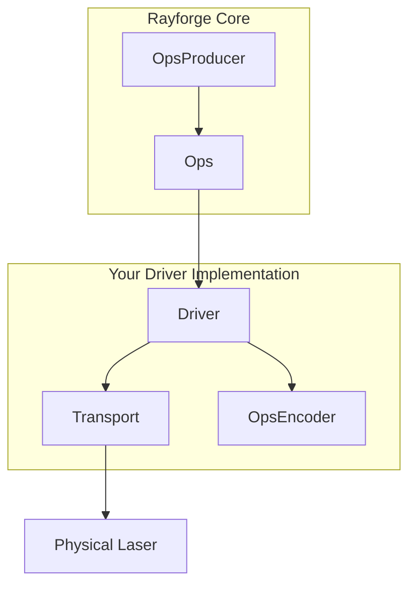

# Rayforge Driver Development Guide

This guide provides a high-level overview of how to create a driver in Rayforge to add support for your laser cutter or engraver. By creating a driver, you integrate your machine's unique communication protocol and command language into the Rayforge ecosystem.

## Driver Overview

A driver is the bridge between Rayforge's core logic and your physical hardware. It is responsible for three main tasks:

1.  **Managing Connectivity:** Handling the low-level communication protocol (Serial, WebSocket, HTTP, etc.).
2.  **Translating and Executing Jobs:** Converting Rayforge's internal representation of a job (`Ops`) into machine-specific commands (like G-code) and sending them to the device.
3.  **Reporting State:** Emitting signals to update the UI with the laser's real-time position, status (`IDLE`, `RUN`), and log messages.

To simplify this, Rayforge provides an architecture based on composable parts:



-   **`OpsEncoder`:** Translates `Ops` into a specific command language (e.g., G-code).
-   **`Transport`:** Manages the connection and data transfer.
-   **`Driver`:** Orchestrates the process, handles device state, and communicates with the UI.

All driver operations are **asynchronous** to ensure the user interface remains responsive.

## The `Ops` Language

Rayforge describes a laser job as a sequence of high-level operations, stored in an `Ops` object. This is the universal language within Rayforge for describing machine movements, independent of any specific hardware.

| `Ops` Method | Signature | Description |
| :--- | :--- | :--- |
| `move_to` | `(x, y, z=0.0)` | Rapid movement (no cutting) |
| `line_to` | `(x, y, z=0.0)` | Cutting/Engraving movement |
| `arc_to` | `(x, y, i, j, cw=True, z=0.0)` | Cutting/Engraving arc movement |
| `set_power` | `(power)` | Set laser power (0-100%) |
| `set_cut_speed` | `(speed)` | Set speed for cutting moves (mm/min) |
| `set_travel_speed` | `(speed)` | Set speed for rapid moves (mm/min) |
| `enable_air_assist` | `()` | Turn on air assist |
| `disable_air_assist`| `()` | Turn off air assist |

Your driver receives an `Ops` object and must execute these operations on the device. Typically, this is done by passing the `Ops` object to an `OpsEncoder`.

```python
# Example of how Rayforge builds an Ops object
ops = Ops()
ops.set_travel_speed(3000)
ops.set_cut_speed(800)
ops.set_power(80)

ops.move_to(10, 10)       # Rapid move to start point
ops.enable_air_assist()
ops.line_to(50, 10)       # Cut a line with air assist
ops.disable_air_assist()
ops.line_to(50, 50)       # Cut a line without air assist
```

## Driver Implementation

All drivers MUST inherit from `rayforge.drivers.Driver`.

```python
from .driver import Driver

class YourDriver(Driver):
    label = "Your Device"  # Display name in the UI
    subtitle = "Description for users"
    supports_settings = False # Set True if the driver can read/write firmware settings
```

### Required Properties

-   `label`: A human-readable name shown in the UI.
-   `subtitle`: A brief description shown below the name.
-   `supports_settings`: A boolean indicating if the driver can read/write device settings (like GRBL's `$$`).

### Required Methods

Your driver class **MUST** implement the following methods. Note that most are **asynchronous** and must be defined with `async def`.

#### Configuration and Lifecycle

-   `get_setup_vars() -> VarSet`: **(Class Method)** Returns a `VarSet` object defining the parameters needed for connection (e.g., IP address, serial port). Rayforge uses this to automatically generate the setup form in the UI.
-   `setup(**kwargs)`: Called once with the values from the setup form. Use this to initialize your transports and internal state.
-   `async def connect()`: Establishes and maintains a persistent connection to the device. This method should contain auto-reconnection logic.
-   `async def cleanup()`: Called when disconnecting. Should close all connections and release resources.

#### Device Control

-   `async def run(ops: Ops, machine: Machine)`: The core method for executing a job. Here, you'll use an `OpsEncoder` to convert the `ops` object into commands and send them to the device.
-   `async def home()`: Homes the machine.
-   `async def move_to(pos_x: float, pos_y: float)`: Manually moves the laser head to a specific XY coordinate.
-   `async def set_hold(hold: bool = True)`: Pauses or resumes the current job.
-   `async def cancel()`: Stops the current job.

#### Firmware Settings (if `supports_settings` is `True`)

-   `get_setting_vars() -> List[VarSet]`: Returns `VarSet` objects that define the structure of the device's settings page.
-   `async def read_settings()`: Reads all settings from the device and calls `_on_settings_read()` with the result.
-   `async def write_setting(key: str, value: Any)`: Writes a single setting to the device.

### Emitting Signals

To communicate with the UI, your driver must emit signals. To ensure proper logging and thread safety, **you must not emit signals directly.** Instead, call the protected helper methods from the base `Driver` class.

-   `self._log(message)`: Sends a log message to the console.
-   `self._on_state_changed()`: Call this whenever you update `self.state` to notify the UI of a status or position change.
-   `self._on_connection_status_changed(status, message)`: Informs the UI about the connection status (`CONNECTING`, `CONNECTED`, `ERROR`, etc.).
-   `self._on_command_status_changed(status, message)`: Reports the status of a sent command.
-   `self._on_settings_read(settings)`: Sends the device settings you've read back to the UI.

## Have Questions?

The best way to learn is to look at the existing drivers, like `GrblNextNetworkDriver`. If you get stuck, please don't hesitate to open an issue on GitHub! We're happy to help.