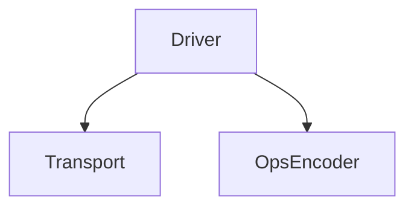
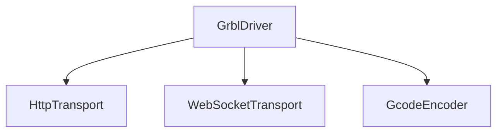
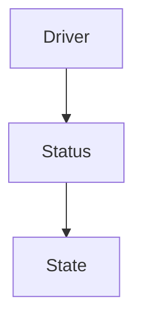

# Rayforge Driver Development Guide

This guide will help you create a new driver to support your laser.

## Driver Overview

A driver:

- **Manages connectivity** (HTTP, WebSocket, serial, etc.).
- Translates generic Ops (machine instructions) into **specific machine commands**
  (e.g., Gcode).
- **Emits signals** for UI integration, such as status changes, laser position
  changes, or log messages.
- **Runs asynchronously** to avoid blocking the main thread.

Rayforge tries to make driver implementation as easy as possible, by providing
modules for most of the above functions. A typical driver uses `Transport` and
`OpsEncoder` classes to provide the above features.



The Transport classes maintain a stable connection to a device, while the Encoder
translates the Rayforge-internal language to something device-specific.

For example, consider the GrblDriver. It communicates through HTTP and Websocket,
so it uses two transports - both of which automatically reconnect as needed.



A driver should track the state of the device it is connected to. It does this
by using the `DeviceStatus` and `DeviceState` classes:

- `DeviceStatus` represents a status such as IDLE, RUN, or ALARM.
- `DeviceState` encapsulates all state information, including the current
  position of the tool, the current speed, the current status, and
  all other states.




## OpsEncoder Overview

The task of an OpsEncoder is to translate **Ops objects** into specific
device commands. Ops objects are the Rayforge-internal "language" that
describes what a machine should do.

Rayforge already comes with a GcodeEncoder that translates Ops to a
string containing G-code commands, so if your device is based on G-code,
you do not have to write your own encoder.

Some vendors use a proprietary language instead of G-Code. For
such devices I recommend that you first implementing an encoder. Only
after the encoder is complete do you probably think about implementing
a driver.


## Ops Overview

One of the main purposes of a driver is to translate the Rayforge-internal
representation of a **laser's movement** and **state changes** into something the
device understands.

Rayforge generates these movements in an `Ops` class. The `Ops` class
represents a sequence of the following operations:

| Method                    | Description                                |
| ------------------------- | ------------------------------------------ |
| `move_to(x, y)`           | Rapid movement to position (no cutting)    |
| `line_to(x, y)`           | Cut/move to position                       |
| `set_power(value)`        | Laser power (0-100%)                       |
| `set_cut_speed(value)`    | Cutting speed in mm/min                    |
| `set_travel_speed(value)` | Rapid movement speed in mm/min             |
| `enable_air_assist()`     | Turn on air assist                         |
| `disable_air_assist()`    | Turn off air assist                        |

The following Ops example shows how Rayforge produces such objects:

```python
ops = Ops()
ops.move_to(0, 0)          # Move to origin
ops.set_power(80)          # Set laser power
ops.enable_air_assist()    # Enable air assist
ops.line_to(100, 100)      # Cut diagonally
```

Rayforge passes the resulting Ops object to the driver's run() method to
execute a program.

To perform the translation into the native language of the device, the driver
SHOULD use an OpsEncoder. You can find examples for such encoders
[here](../rayforge/opsencoder/).


## Driver Implementation

All drivers MUST inherit from `rayforge.drivers.Driver`.

```python
from .driver import Driver

class YourDriver(Driver):
    label = "Your Device"  # Display name in the UI
    subtitle = "Description for users"
```

### Methods

All drivers MUST provide the following methods:

- `setup()`: This is a special method that has two purposes:
    o Any arguments in the definition of the method are used to
      auto-generate a user interface. For example, if the setup()
      method ist defined as `setup(self, hostname: str)`, then
      Rayforge will use the type hint to offer the user a UI
      for entering a hostname.

    o `setup()` is invoked after the user has configured the
       driver in the UI.

- `cleanup()`: Closes all connections and frees resources.
- `connect()`: Opens and maintains a persistent connection until cleanup()
   is called.
- `run(ops: Ops)`: Called to execute the given operations on the
   connected device.
- `home()`: Homes the device.
- `hold(hold: bool = True)`: Pause/unpause the running program.
- `cancel()`: Cancels the running program.
- `move_to(x: float, y: float)`: Move the laser to the given position.
   Positions are passed in millimeters.

Example for a `setup()`method:

```python
def setup(self, ip_address: str, port: int = 8080, enable_debug: bool = False):
    """
    Parameters:
      - ip_address: Device IP (e.g., "192.168.1.100")
      - port: HTTP port (default: 8080)
      - enable_debug: Log extra details (default: False)
    """
    super().setup()
    # Initialize your hardware connection here
```

The `setup()` method defines configuration fields that users will see in
the UI. **Only `str`, `int`, and `bool` types are supported.**

### Properties

Drivers MUST have the following properties:

- `label`: Contains a label to be shown as the driver name in the UI.
- `subtitle`: Contains a subtitle to be shown in the UI.

### Signals

All drivers may provide the following signals:

- `log_received`: for log messages
- `position_changed`: to monitor the position (in mm)
- `command_status_changed`: to monitor a command that was sent
- `connection_status_changed`: signals connectivity changes

Note: All drivers also *implicitly* creates GLib-safe wrappers
for the above signals; you MUST NOT emit these directly.

## State Management

- Assume hardware retains state between commands (e.g., laser power)
- Re-send critical states after reconnections

## Any questions?

Please contact us through Github Issues!
