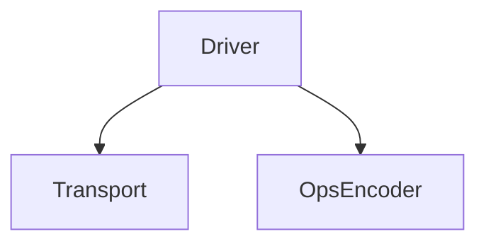
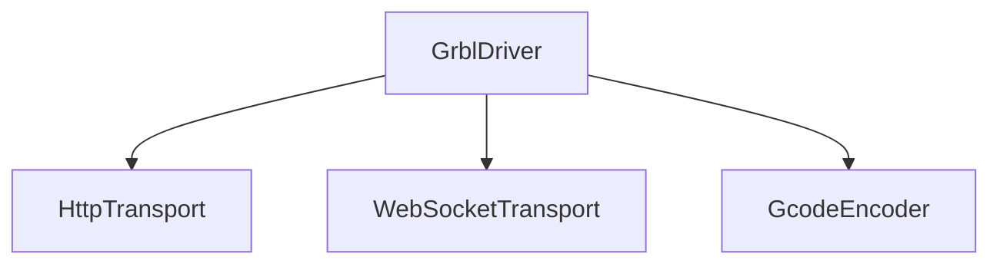
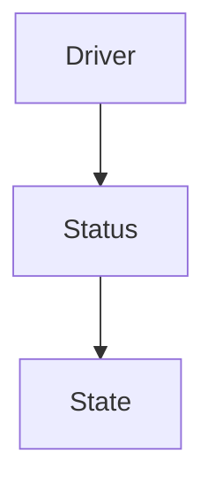
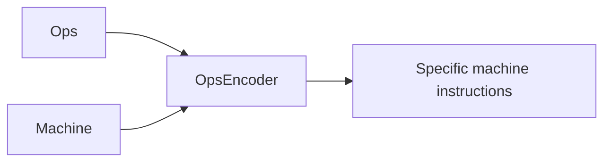

# Rayforge Driver Development Guide

This guide will help you create a new driver to support your laser.

## Driver Overview

A driver:

- **Manages connectivity** (HTTP, WebSocket, serial, etc.).
- Translates generic Ops (machine instructions) into **specific machine commands**
  (e.g., Gcode).
- **Emits signals** for UI integration, such as status changes, laser position
  updates, or log messages.
- **Runs asynchronously** to avoid blocking the main thread.

Rayforge simplifies driver implementation by providing modules for most common
tasks. A typical driver uses `Transport` and `OpsEncoder` classes to handle
connectivity and command translation.



- Transport classes maintain stable connections to devices (with automatic
  reconnection).
- Encoders convert Rayforge's internal Ops language into device-specific
  commands.

For example, the GrblDriver uses HTTP and WebSocket transports alongside a
G-code encoder:



A driver should track the state of the device it is connected to. It does this
by using the `DeviceStatus` and `DeviceState` classes:

- `DeviceStatus` represents a status such as IDLE, RUN, or ALARM.
- `DeviceState` Encapsulates full device state (position, speed, status, etc.).




## OpsEncoder Overview

An OpsEncoder translates **Ops objects** into device-specific
commands. Ops objects are the Rayforge-internal "language" that
describes what a machine should do.

Rayforge includes a GcodeEncoder for G-code-compatible devices.
For proprietary languages, implement a custom encoder first before
developing the driver.

The OpsEncoder has only one method with the following signature:

```python
def encode(ops: Ops, machine: Machine) -> str:
```

The Machine object is passed for additional hints, so that the
encoder can respect any machine settings that may affect the
translation.




## Ops Overview

One of the main purposes of a driver is to translate the Rayforge-internal
representation of a **laser's movement** and **state changes** into something the
device understands.

Rayforge generates these movements in an `Ops` class. The `Ops` class
represents a sequence of the following operations:

| Method                    | Description                                |
| ------------------------- | ------------------------------------------ |
| `move_to(x, y)`           | Rapid movement (no cutting) (mm)           |
| `line_to(x, y)`           | Cutting movement (mm)                      |
| `arc_to(x, y, i, j)`      | Cutting arc movement (mm)                  |
| `set_power(value)`        | Laser power (0-100%)                       |
| `set_cut_speed(value)`    | Cutting speed (mm/min)                     |
| `set_travel_speed(value)` | Rapid movement speed (mm/min)              |
| `enable_air_assist()`     | Turn on air assist                         |
| `disable_air_assist()`    | Turn off air assist                        |

The following Ops example shows how Rayforge produces such objects:

```python
ops = Ops()
ops.move_to(0, 0)          # Move to origin
ops.set_power(80)          # Set laser power
ops.enable_air_assist()    # Enable air assist
ops.line_to(100, 100)      # Cut diagonally
```

Rayforge passes the resulting Ops object to the driver's `run()` method to
execute a program.

As explained above, the driver SHOULD use an OpsEncoder to perform the translation
into the native language of the device.
You can find examples for such encoders [here](../rayforge/opsencoder/).


## Driver Implementation

All drivers MUST inherit from `rayforge.drivers.Driver`.

```python
from .driver import Driver

class YourDriver(Driver):
    label = "Your Device"  # Display name in the UI
    subtitle = "Description for users"
```

### Methods

All drivers MUST provide the following methods:

- `setup()`: This is a special method that has two purposes:

    o Any arguments in the definition of the method are used to
      auto-generate a user interface. For example, if the setup()
      method ist defined as `setup(self, hostname: str)`, then
      Rayforge will use the type hint to offer the user a UI
      for entering a hostname.
      **Only `str`, `int`, and `bool` types are supported.**

    o `setup()` is invoked after the user has configured the
       driver in the UI.

  Example:
    ```python
    def setup(self, ip_address: str, port: int = 8080, enable_debug: bool = False):
        """
        Parameters:
          - ip_address: Device IP (e.g., "192.168.1.100")
          - port: HTTP port (default: 8080)
          - enable_debug: Log extra details (default: False)
        """
        super().setup()
        # Initialize your hardware connection here
    ```

- `cleanup()`: Closes all connections and frees resources.
- `connect()`: Opens and maintains a persistent connection until cleanup()
   is called.
- `run(ops: Ops)`: Called to execute the given operations on the
   connected device.
- `home()`: Homes the device.
- `hold(hold: bool = True)`: Pause/unpause the running program.
- `cancel()`: Cancels the running program.
- `move_to(x: float, y: float)`: Move the laser to the given position.
   Positions are passed in millimeters.

### Properties

Drivers MUST have the following properties:

- `label`: Contains a label to be shown as the driver name in the UI.
- `subtitle`: Contains a subtitle to be shown in the UI.

### Signals

All drivers may provide the following signals:

- `log_received`: for log messages
- `state_changed`: to monitor the state (see State object explanation above)
- `command_status_changed`: to monitor a command that was sent
- `connection_status_changed`: signals connectivity changes

You MUST NOT emit these directly! Instead, call the base class
wrapper methods of the Driver for these methods, such as:

- `Driver._log()`
- `Driver._on_state_changed()`
- `Driver._on_command_status_changed()`
- `Driver._on_connection_status_changed()`

This ensures that the signals are sent in a GLib-safe manner.


## State Management

- Assume hardware retains state between commands (e.g., laser power)
- Re-send critical states after reconnections


## Any questions?

Please contact us through Github Issues!
