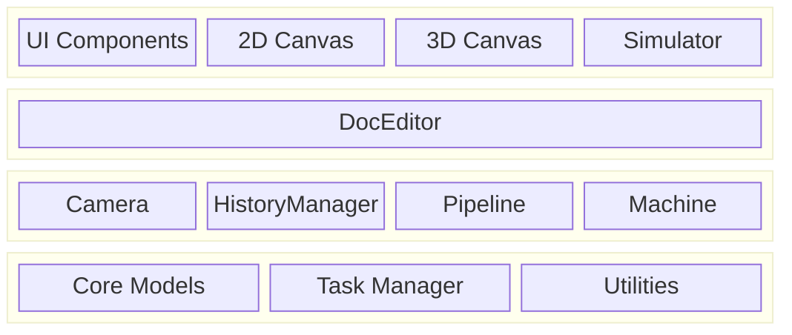

# Rayforge Architecture

This document provides a high-level architectural overview of Rayforge,
explaining how the major components relate to each other. For deep dives into
specific areas, please refer to the linked documents.

## Table of Contents

- [Layered Application Architecture](#layered-application-architecture)
- [Code Architecture](#code-architecture)
- [Document Model Architecture](#document-model-architecture)
- [Pipeline Architecture](#pipeline-architecture)

---

## Layered Application Architecture

The application is structured in logical layers, separating the user
interface, application logic, and core services. This promotes a clean
separation of concerns and clarifies the flow of control

- **UI Layer (View)**: Contains all user-facing elements. The `Workbench` is
  the main canvas area which hosts the 2D and 3D views.
- **Editor/Controller Layer**: The `DocEditor` acts as the central
  controller, responding to UI events and manipulating the core models.
- **Core / Services Layer**: Provides foundational services and state.
  `Core Models` represent the document, `Tasker` manages background jobs,
  `Machine` handles device communication, and `Camera` manages viewports.

---

## Code Architecture

Rayforge is a GTK4/Libadwaita application with a modular, pipeline-driven
architecture.

- **`rayforge/core/`**: Document model and geometry handling.
- **`rayforge/pipeline/`**: The core processing pipeline for generating
  machine operations from the document model.
- **`rayforge/machine/`**: Hardware interface layer, including device
  drivers, transport protocols, and machine models.
- **`rayforge/doceditor/`**: The main document editor controller and its UI.
- **`rayforge/workbench/`**: The 2D/3D canvas and visualization systems.
- **`rayforge/image/`**: Importers for various file formats (SVG, DXF, etc.).
- **`rayforge/shared/`**: Common utilities, including the `tasker` for
  background job management.

---

## Document Model Architecture

The document model is a hierarchical tree of objects based on the
**Composite Pattern**. This structure represents the user's entire project,
from the root `Doc` object down to individual `WorkPiece`s. It is designed to be
reactive and serializable.

**[See Document Model Architecture for details](./docmodel.md)**

---

## Pipeline Architecture

The pipeline converts the document model into machine-executable G-code. It
runs asynchronously in the background and uses a shared-memory `Artifact`
system for high-performance data transfer between processes. The pipeline is
composed of stages: **Modifiers → Producers → Transformers → Encoders**.

**[See Pipeline Architecture for details](./pipeline.md)**
