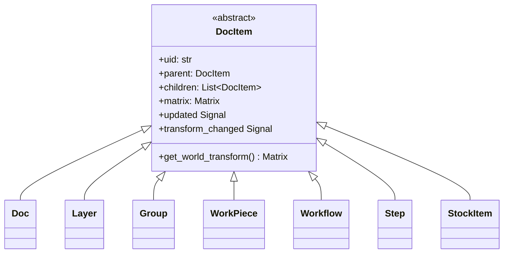
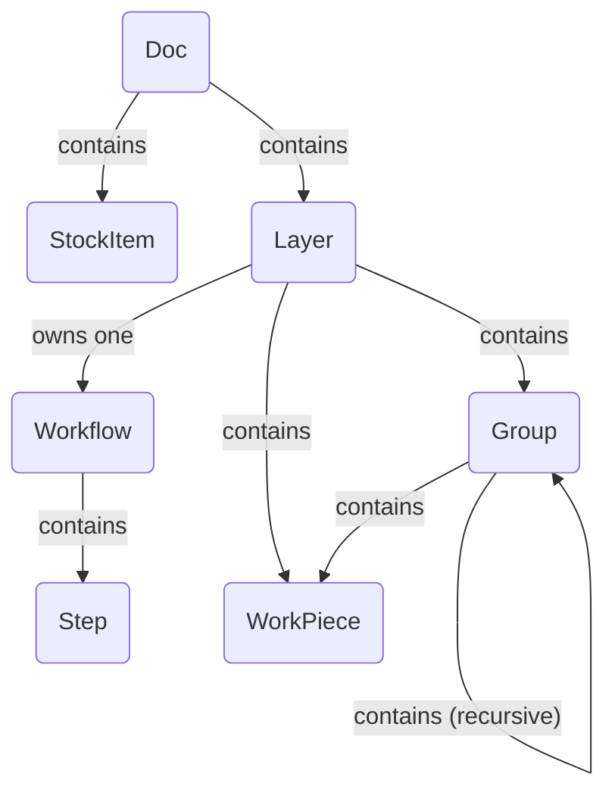

# Document Model Architecture

The document model is the backbone of the application, representing the
entire user project as a hierarchical tree of objects. It is designed to
be reactive, serializable, and easily traversable.

## Overview

The architecture is built on the **Composite design pattern**. A single
abstract base class, `DocItem`, defines the common interface for all
objects that can exist in the document tree (e.g., layers, workpieces,
groups). This allows complex, nested structures to be treated uniformly.

Key principles of the model include:

- **Tree Structure:** The `Doc` object serves as the root of the tree. Each
  item (except the root) has a single `parent` and can have multiple
  `children`.
- **Reactivity:** The model uses a signal/slot system (`blinker`). When an
  item is changed, it emits a signal. Parent items listen to their
  children's signals and "bubble them up" the tree. This allows
  high-level components like the `Pipeline` to listen for any
  change in the document by connecting to a single signal on the root
  `Doc` object. The system tracks both content changes and transform
  changes separately for efficient updates.
- **Transformation Hierarchy:** Every `DocItem` has a local transformation
  `Matrix`. An item's final position, scale, and rotation in the "world"
  (the main canvas) is the product of its own local matrix and the
  world matrices of all its ancestors.
- **Data Decoupling:** The visual or raw data for a `WorkPiece` is not
  stored directly within it. Instead, the `WorkPiece` holds a UID that
  references an `ImportSource` object in a central registry on the `Doc`.
  This decouples the document structure from the data management,
  making the model more lightweight and flexible.

---

## Class Inheritance

This diagram shows the class hierarchy. Every object that is part of the
document's spatial tree inherits from the abstract base class `DocItem`,
gaining core functionalities like parenting, transformations, and signal
bubbling.

- **`DocItem`**: The abstract foundation providing the composite pattern
  implementation.
- All other classes are concrete implementations of `DocItem`, each with a
  specialized role in the document structure.

---

## Object Composition

This diagram illustrates how instances of the classes are assembled to form
a complete document. It shows the parent-child relationships and
references between objects.

- A `Doc` is the top-level object. It **contains** one or more `Layer`s and
  `StockItem`s. It also **manages** a registry of all `ImportSource`s in
  the project.
- Each `Layer` **contains** the user's content: `WorkPiece`s and `Group`s.
  Crucially, a `Layer` also **owns one** `Workflow`.
- A `Workflow` **contains** an ordered list of `Step`s, which define the
  manufacturing process for that layer.
- A `Group` is a container that can hold `WorkPiece`s and other `Group`s,
  allowing for nested transformations.
- A `WorkPiece` is a fundamental design element. It does not store its
  raw data directly. Instead, it **references** an `ImportSource` via a
  UID. It also **has** its own `Geometry` (vector data) and can have a
  list of `Tab`s.

---

## DocItem Descriptions

- **`DocItem` (Abstract)**

  - **Role:** The abstract base for all tree nodes.
  - **Key Properties:** `uid`, `parent`, `children`, `matrix`, `updated`
    signal, `transform_changed` signal. Provides the core composite
    pattern logic.

- **`Doc`**

  - **Role:** The root of the document tree.
  - **Key Properties:** `children` (Layers, StockItems), `import_sources`
    (a dictionary mapping UIDs to `ImportSource` objects), `active_layer`.

- **`Layer`**

  - **Role:** The primary organizational unit for content. A layer
    associates a group of workpieces with a single manufacturing
    workflow.
  - **Key Properties:** `children` (WorkPieces, Groups, one Workflow),
    `visible`, `stock_item_uid`.

- **`Group`**

  - **Role:** A container for other `DocItem`s (`WorkPiece`, `Group`).
    Allows a collection of items to be transformed as a single unit.

- **`WorkPiece`**

  - **Role:** Represents a single, tangible design element on the canvas
    (e.g., an imported SVG).
  - **Key Properties:** `vectors` (a `Geometry` object),
    `import_source_uid`,
    `tabs`, `tabs_enabled`. Its `vectors` are normalized to a 1x1 box,
    with all scaling and positioning handled by its transformation
    `matrix`.

- **`Workflow`**

  - **Role:** An ordered sequence of processing instructions. Owned by a
    `Layer`.
  - **Key Properties:** `children` (an ordered list of `Step`s).

- **`Step`**

  - **Role:** A single processing instruction within a `Workflow` (e.g.,
    "Contour Cut" or "Raster Engrave"). It is a configuration object
    holding dictionaries that define the producer, modifiers, and
    transformers to be used.

- **`StockItem`**
  - **Role:** Represents a piece of physical material in the document,
    defined by its own vector `geometry`. `Layer`s can be assigned to a
    specific stock item.
