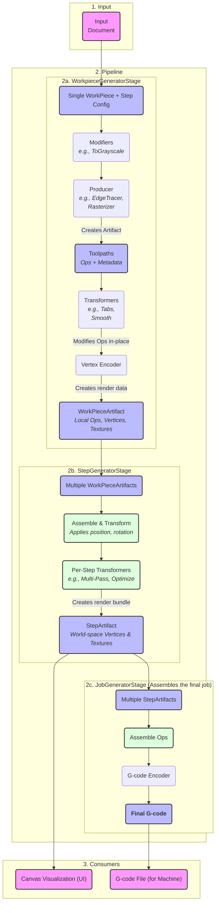

# **Sequential Pipeline Architecture**

This document describes the pipeline in a linear, sequential flow, showing how
raw design data is progressively transformed into the final outputs used for
visualization and manufacturing.

# **Detailed Breakdown of the Sequence**

## **1. Input**

The process begins with the **Input**, which is the `Doc Model`. This is the
complete representation of the user's project, containing:

- **WorkPieces:** The individual design elements (like SVGs or images) that
  have been placed on the canvas.
- **Steps:** The specific instructions for how to process those WorkPieces
  (e.g., a "Contour" cut or a "Raster" engrave), including settings like
  power and speed.

## **2. The Pipeline**

The `Pipeline` is the core processing engine that runs in the background.
It takes the `Doc Model` as its input and orchestrates a series of distinct
`PipelineStage`s.

### **2a. WorkpieceGeneratorStage: Per-Item Processing**

This stage processes each `(WorkPiece, Step)` combination individually to
create a cached `WorkPieceArtifact`. This artifact contains toolpaths in the
**local coordinate system** of the workpiece. Its internal sequence is:

1.  **Modifiers:** (Optional) If the input is a raster image, modifiers
    perform initial image conditioning, such as converting it to grayscale.
2.  **Producer:** A `Producer` (like `EdgeTracer` or `Rasterizer`) analyzes
    the input and creates the raw toolpaths (`Ops`) and metadata.
3.  **Per-Workpiece Transformers:** The newly generated `Ops` are passed
    through transformers specific to that workpiece, such as adding
    holding `Tabs` or `Smooth`ing the geometry.
4.  **Vertex Encoder:** The processed `Ops` are encoded into GPU-friendly
    `Vertex Data` (for lines) and `Texture Data` (for raster fills).

The output is a **WorkPieceArtifact** stored in shared memory. This contains
un-positioned, un-rotated data ready for the next stage.

### **2b. StepGeneratorStage: Step-Level Assembly**

This stage is responsible for assembling a final **render bundle** for an
entire step. It consumes the `WorkPieceArtifacts` for all workpieces that
are part of a given step.

1.  **Assemble & Transform:** The stage retrieves all required
    `WorkPieceArtifacts` from the cache. It then applies the final world
    transformations to each one—placing them at their correct X/Y position
    and applying rotation. All these individual toolpaths and textures are
    combined.
2.  **Per-Step Transformers:** The unified `Ops` are then processed
    by transformers that operate on the step as a whole, such as path
    `Optimize`ation or `Multi-Pass` operations.

The output is a **StepArtifact**. This is a self-contained bundle for the
UI, containing all vertex and texture data for the entire step, now in
final **world-space** coordinates.

### **2c. JobGeneratorStage: Final Job Assembly**

This stage is invoked when the user wants to generate the final G-code. It
consumes the `StepArtifacts` created by the `StepGeneratorStage`.

1.  **Assemble Ops:** The `JobGeneratorStage` retrieves all required
    `StepArtifacts` from the cache and combines their `Ops` into a single,
    large sequence representing the entire job from start to finish.
2.  **G-code Encoder:** The final, complete `Ops` object is fed into the
    `G-code Encoder`, which translates the machine-agnostic commands
    into the specific G-code dialect required by the user's machine.

The final output is the complete **G-code** text.

## **3. Consumers**

The data generated by the pipeline is consumed by two primary clients:

1.  **Canvas Visualization (UI):** The UI directly consumes the
    **StepArtifacts**. Because these artifacts contain final, world-space
    vertex and texture data, the renderer's job is simple: load the data from
    the artifact's shared memory into GPU buffers and draw it. There is no
    need for a separate `SceneAssembler`, as the `StepGeneratorStage` now
    produces the complete renderable bundles. This approach is highly
    efficient and keeps the main UI thread responsive.

2.  **G-code File (for Machine):** The final **G-code** from the
    `JobGeneratorStage` is saved to a file, which can then be sent to the
    laser cutter or CNC machine for manufacturing. The G-code includes proper
    header/footer, coordinate setup, and machine-specific commands.