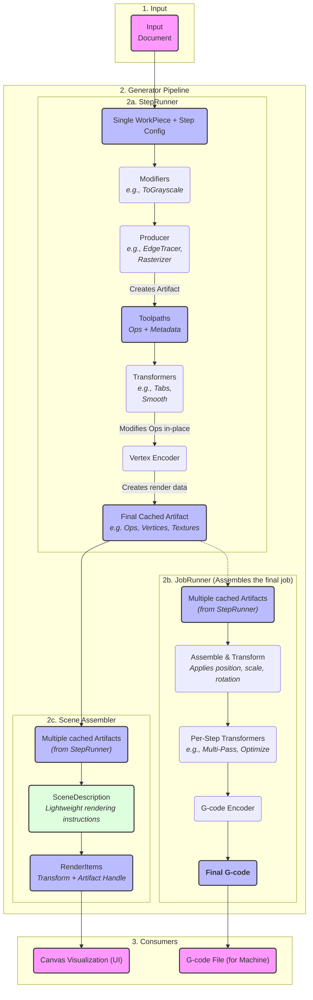

# **Sequential Pipeline Architecture**

This document describes the pipeline in a linear, sequential flow, showing how
raw design data is progressively transformed into the final outputs used for
visualization and manufacturing.

# **Detailed Breakdown of the Sequence**

## **1. Input**

The process begins with the **Input**, which is the `Doc Model`. This is the
complete representation of the user's project, containing:

- **WorkPieces:** The individual design elements (like SVGs or images) that
  have been placed on the canvas.
- **Steps:** The specific instructions for how to process those WorkPieces
  (e.g., a "Contour" cut or a "Raster" engrave), including settings like
  power and speed.

## **2. The Generator**

The `Generator` is the core processing engine that runs in the background.
It takes the `Doc Model` as its input and orchestrates two distinct but
related processes: the `StepRunner` and the `JobRunner`.

### **2a. StepRunner: Per-Item Processing**

The `StepRunner` processes each `(WorkPiece, Step)` combination individually
to create a cached, reusable result. This allows for fast updates when only
a single item changes. Its internal sequence is:

1.  **Modifiers:** (Optional) If the input is a raster image, modifiers
    perform initial image conditioning, such as converting it to grayscale.
2.  **Producer:** This is the primary generation step. A `Producer` (like
    `EdgeTracer` or `Rasterizer`) analyzes the input and creates an
    `Artifact`. This initial artifact contains the raw toolpaths (`Ops`)
    and metadata describing the result (e.g., if it's scalable).
3.  **Per-Workpiece Transformers:** The newly generated `Ops` are passed
    through transformers that are specific to that individual workpiece,
    such as adding holding `Tabs` or `Smooth`ing the geometry.
4.  **Vertex Encoder:** Finally, the processed `Ops` are encoded into
    GPU-friendly formats for display. This generates `Vertex Data` (for
    lines and paths) and `Texture Data` (for raster fills).

The final output is a **Cached Artifact** stored in shared memory. This
artifact contains everything needed for both visualization and final
job assembly. The artifact system uses NumPy arrays for efficient
data transfer between processes and includes vertex data for GPU rendering
and command data for G-code generation.

### **2c. Scene Assembler: Efficient Rendering Instructions**

The `Scene Assembler` creates a lightweight description of the scene for
rendering, avoiding the creation of monolithic Ops objects for the UI.
This component bridges the gap between cached artifacts and efficient
UI rendering.

**Key Components:**

1. **RenderItem:** A lightweight instruction for rendering one artifact,
   containing:
   - `artifact_handle`: Reference to cached artifact data
   - `texture_data`: Texture data for raster-type artifacts
   - `world_transform`: 4x4 numpy transformation matrix
   - `workpiece_size`: The final rendered dimensions
   - `step_uid`: Unique identifier for the processing step
   - `workpiece_uid`: Unique identifier for the workpiece

2. **SceneDescription:** A complete, lightweight description of a scene
   for rendering, containing a list of all RenderItem instances.

**Process Flow:**

1. **Scene Analysis:** The SceneAssembler iterates through all visible
   items in the document, identifying renderable (Step, WorkPiece) pairs.
2. **Artifact Retrieval:** For each pair, it fetches both the handle and
   the full artifact from the OpsGenerator's cache.
3. **Transform Calculation:** It calculates the final world transformation
   matrix for each workpiece using `workpiece.get_world_transform()`.
4. **Lightweight Assembly:** It creates RenderItem instances containing
   only the transformation data and references to cached artifacts,
   avoiding heavy data processing on the main thread.

**Benefits:**
- **Performance:** Only lightweight transformation data is processed on
  the main thread, keeping the UI responsive.
- **Memory Efficiency:** Avoids creating large monolithic Ops objects
  for visualization.
- **Scalability:** Supports efficient rendering of complex scenes with
  many elements.
- **Caching:** Leverages the existing artifact cache system for maximum
  efficiency.

### **2b. JobRunner: Final Assembly**

The `JobRunner` is invoked when the user wants to generate the final G-code
for the entire project. It consumes the artifacts created by the
`StepRunner`.

1.  **Assemble & Transform:** The `JobRunner` retrieves all the required
    `Artifacts` from the cache. It then applies the final world
    transformations to each one—placing them at their correct X/Y position,
    applying rotation, and scaling them to their final size. All these
    individual toolpaths are combined into a single, large `Ops` object.
2.  **Per-Step Transformers:** This unified `Ops` object is then processed
    by transformers that operate on the job as a whole. This is where final
    path `Optimize`ation (to reduce travel moves) and `Multi-Pass`
    operations are applied.
3.  **G-code Encoder:** The final, optimized `Ops` object is fed into the
    `G-code Encoder`, which translates the machine-agnostic commands
    into the specific G-code dialect required by the user's machine.
    The encoder handles machine-specific formatting, coordinate systems,
    and command syntax.

The final output is the complete **G-code** text.

## **3. Consumers**

The data generated by the pipeline is consumed by two primary clients:

1.  **Canvas Visualization (UI):** The UI uses the **SceneDescription** from
    the Scene Assembler for efficient rendering. Each RenderItem contains
    transformation data and references to cached artifacts, allowing the
    rendering system to:
    - Apply world transformations on the GPU
    - Use pre-computed vertex and texture data from artifacts
    - Maintain responsiveness by avoiding heavy data processing on the main thread
    - Support progressive updates as individual artifacts become available
    
    The rendering system uses OpenGL buffers populated directly from the
    NumPy arrays in the artifacts, combined with the transformation matrices
    from the RenderItems. This separation of concerns allows the UI to remain
    fast and responsive even with complex scenes.

2.  **G-code File (for Machine):** The final **G-code** from the `JobRunner`
    is saved to a file, which can then be sent to the laser cutter or CNC
    machine for manufacturing. The G-code includes proper header/footer,
    coordinate setup, and machine-specific optimizations.
