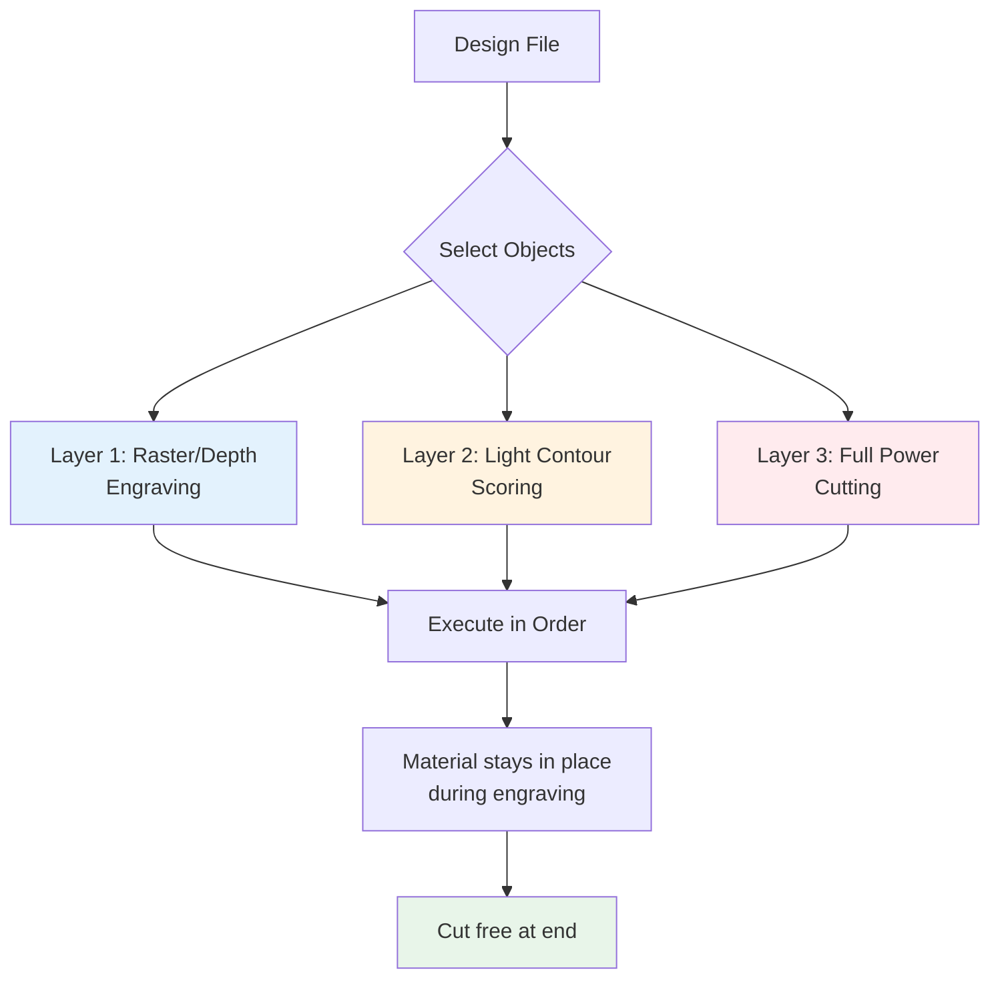

# Features Overview

Rayforge provides a comprehensive set of features for laser cutting and engraving. This section covers all the major capabilities and how to use them effectively.

## Operations

Operations define how Rayforge processes your designs. Each operation type is optimized for specific tasks:

- **[Contour Cutting](operations/contour.md)**: Cut along the outline of shapes
- **[Raster Engraving](operations/raster.md)**: Fill shapes with engraving patterns
- **[Depth Engraving](operations/depth.md)**: Create 3D relief effects from images
- **[Shrink Wrap](operations/shrink-wrap.md)**: Create efficient cutting paths around multiple objects

## Workflow Features

- **[Multi-Layer Operations](multi-layer.md)**: Assign different operations to layers in your design for complex workflows
- **[Holding Tabs](holding-tabs.md)**: Add tabs to contour cuts to keep pieces in place during cutting
- **[G-code Macros & Hooks](macros-hooks.md)**: Automate tasks with custom G-code snippets

## Quality Enhancement

- **[Overscan](overscan.md)**: Improve engraving quality
- **[Kerf Compensation](kerf.md)**: Improve dimensional accuracy

## Hardware Integration

- **[Camera Integration](camera.md)**: Use a USB camera for workpiece alignment, positioning, and background tracing

## Quick Feature Reference

| Feature                    | Description                                                                 | Learn More |
|:---------------------------|:----------------------------------------------------------------------------|:-----------|
| Multi-Layer Operations     | Assign different operations (engrave, cut) to layers                        | [Guide](multi-layer.md) |
| 3D G-code Preview          | Visualize toolpaths before sending to machine                               | [UI Guide](../ui/3d-preview.md) |
| Holding Tabs               | Auto or manual tab placement for contour cuts                               | [Guide](holding-tabs.md) |
| Overscan                   | Reduce burn marks at raster engraving endpoints                             | [Guide](overscan.md) |
| Kerf Compensation          | Adjust paths to compensate for material removed by laser                    | [Guide](kerf.md) |
| 2.5D Cutting               | Multi-pass cuts with configurable step-down for thick materials             | [Operations](operations/contour.md) |
| Camera Alignment           | Position designs using live camera feed                                     | [Camera Guide](camera.md) |
| Path Optimization          | Minimize travel time and improve quality                                    | [Operations](operations/index.md) |
| Variable Substitution      | Use variables in macros and hooks                                           | [Macros Guide](macros-hooks.md) |

## Best Practices

### Operation Selection

- Use **Contour** for cutting out shapes and profiles
- Use **Raster** for filling areas with engraving (wood, leather, etc.)
- Use **Depth Engraving** for 3D effects on materials like acrylic or coated metals
- Use **Shrink Wrap** when you need to cut around multiple objects efficiently

### Layer Organization

Organize your designs by operation type:

1. **Layer 1**: Engraving operations (run first)
2. **Layer 2**: Scoring or marking operations
3. **Layer 3**: Through-cutting operations (run last)

!!! tip "Why this order?"
    Engraving first prevents the material from moving if it's cut free. Cutting last ensures all other operations complete while the material is secured.

### Power and Speed

Start with conservative settings and gradually increase:

- **Too fast/low power**: Incomplete cuts, light engraving
- **Too slow/high power**: Charring, melted edges, fire risk

Always test on scrap material first!

---

Explore each feature section to learn how to get the most out of Rayforge.
