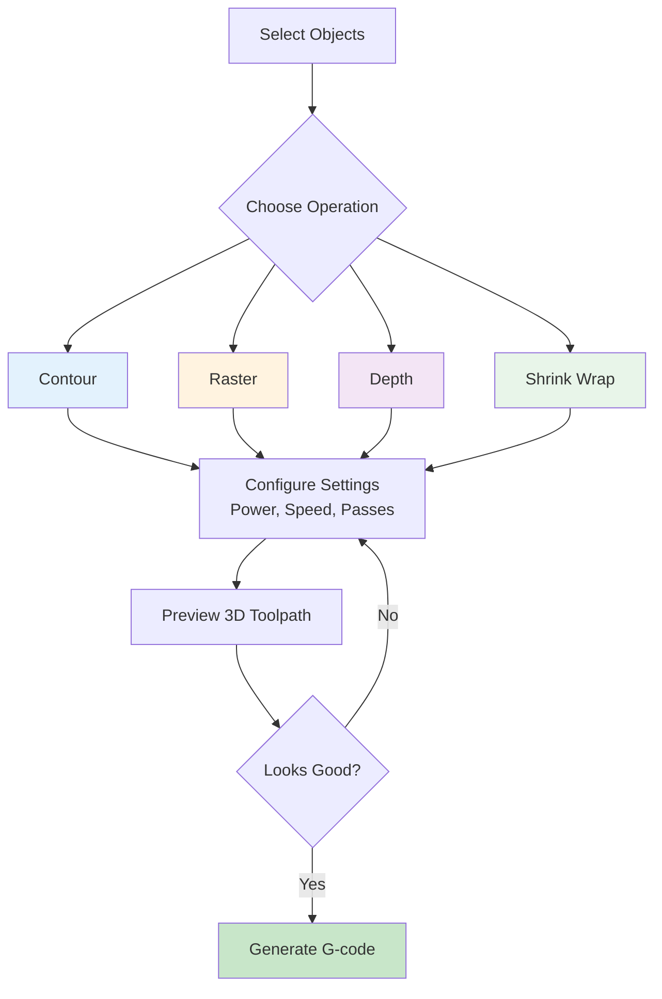

# Operations

Operations define how Rayforge processes your designs. Each operation type converts vector paths or raster images into toolpaths optimized for specific laser tasks.

## Operation Workflow

## Operation Types

Rayforge supports four main operation types:

### [Contour Cutting](contour.md)

Cut along the outline of shapes and paths.

**Best For:**

- Cutting out shapes and profiles
- Through-cutting materials
- Creating precise outlines
- Die-cutting and stencils

**Key Features:**

- Multi-pass cutting for thick materials
- Kerf compensation for dimensional accuracy
- Holding tabs to keep pieces in place
- Lead-in/lead-out for smooth starts and stops

### [Raster Engraving](raster.md)

Fill areas with back-and-forth engraving lines (bi-directional scanning).

**Best For:**

- Engraving photos and images
- Filling large areas
- Wood and leather engraving
- Creating textures and patterns

**Key Features:**

- Overscan to eliminate endpoint burn marks
- Cross-hatch fill for consistent coverage
- Variable power based on image brightness
- Line interval (spacing) control

### [Depth Engraving](depth.md)

Create 3D relief effects by varying power based on image brightness.

**Best For:**

- 3D effects on acrylic or coated metals
- Grayscale photo engraving with depth
- Embossing effects
- Relief sculptures

**Key Features:**

- Depth mapping from image brightness
- Configurable min/max depth
- Smooth gradients
- Compatible with grayscale images

### [Shrink Wrap](shrink-wrap.md)

Create efficient cutting paths around multiple objects.

**Best For:**

- Cutting around grouped objects
- Waste reduction
- Efficient material usage
- Quick outline cuts

**Key Features:**

- Automatic hull calculation
- Configurable offset distance
- Combines multiple objects into single path

## Operation Workflow

### 1. Select Objects

Select one or more objects on the canvas that you want to apply the operation to.

### 2. Add Operation

- **Menu**: Operations → Add Operation
- **Keyboard**: ++ctrl+shift+a++
- **Context menu**: Right-click → Add Operation

### 3. Configure Settings

Each operation type has specific settings:

- **Power**: Laser power percentage (0-100%)
- **Speed**: Movement speed (mm/min)
- **Passes**: Number of times to repeat the operation
- **Advanced options**: Varies by operation type

### 4. Preview

Use the 3D preview (++ctrl+3++) to visualize the toolpath before sending to your machine.

### 5. Generate G-code

When ready, generate G-code (++ctrl+g++) to create machine instructions.

## Operation Settings

### Common Settings

These settings are available for all operation types:

| Setting | Description | Typical Range |
|:--------|:------------|:--------------|
| **Name** | Operation identifier | Any text |
| **Power** | Laser power percentage | 0-100% |
| **Speed** | Feed rate in mm/min | 100-6000 mm/min |
| **Passes** | Number of repetitions | 1-10 |
| **Enabled** | Enable/disable operation | On/Off |
| **Layer** | Assign to specific layer | Layer 1-10 |

### Advanced Settings

Additional settings vary by operation type:

- **Contour**: Kerf, tabs, lead-in/lead-out
- **Raster**: Overscan, line interval, angle
- **Depth**: Min/max depth, smoothing
- **Shrink Wrap**: Offset distance, segments

## Operation Order

Operations execute in the order they appear in the layers panel. Reorder operations by dragging them up or down.

**Best Practice Order:**

1. **Engraving operations** (Raster, Depth)
2. **Scoring operations** (Light contour cuts)
3. **Through-cutting operations** (Contour with full power)

!!! tip "Why this order?"
    Engraving first ensures the material stays in place. Cutting last prevents pieces from moving during earlier operations.

## Tips for Success

### Power and Speed

Start conservative and increase gradually:

- **Too fast/low power**: Incomplete cuts, light engraving
- **Too slow/high power**: Charring, melted edges, fire risk

### Multiple Passes

Use multiple passes for:

- Thick materials that won't cut in one pass
- Achieving deeper engraving
- Better edge quality on sensitive materials

### Testing

Always test on scrap material:

1. Create a small test pattern
2. Try different power/speed combinations
3. Document successful settings for future jobs
4. Keep a material library with proven settings

---

Explore each operation type for detailed information and examples:

- **[Contour Cutting →](contour.md)**
- **[Raster Engraving →](raster.md)**
- **[Depth Engraving →](depth.md)**
- **[Shrink Wrap →](shrink-wrap.md)**
