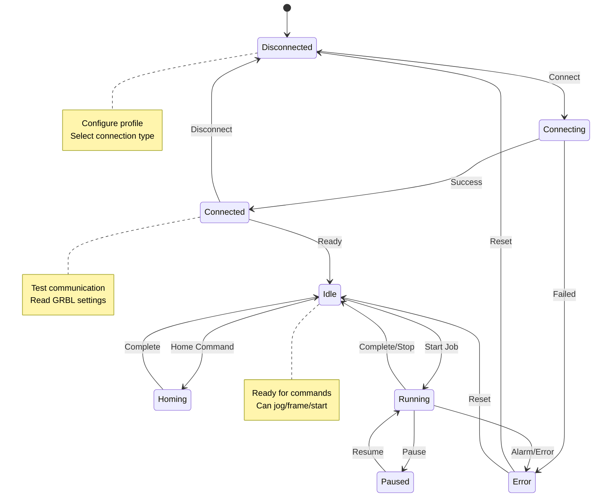

# Machine Setup

Configure your laser cutter or engraver to work with Rayforge. This section covers machine profiles, device connections, and hardware configuration.

## Quick Start

1. **[Machine Profiles](profiles.md)**: Create profiles for different machines
2. **[Device Configuration](device-config.md)**: Connect via serial, network, or telnet
3. **[GRBL Settings](grbl-settings.md)**: Configure firmware parameters
4. **[Multiple Lasers](multi-laser.md)**: Set up machines with multiple laser modules

## Supported Devices

Rayforge supports a wide range of GRBL and Smoothieware-based laser cutters:

### GRBL Devices

- **Connection**: Serial (USB) or Network (WiFi/Ethernet)
- **Versions**: GRBL 1.1 and later
- **Common Brands**:
  - Ortur
  - Atomstack
  - Xtool
  - Generic K40 with GRBL board
  - DIY GRBL builds

### Smoothieware Devices

- **Connection**: Telnet over network
- **Versions**: Smoothieware v1 and v2
- **Common Brands**:
  - Cohesion3D boards
  - Custom CNC controllers

## Machine Profiles

Machine profiles store all configuration for a specific laser cutter:

- Working area dimensions
- Power and speed ranges
- Origin position
- Laser module configuration
- Device connection settings
- GRBL/firmware parameters

**Benefits of Profiles:**

- Switch between multiple machines instantly
- Share configurations with others
- Backup and restore settings
- Test different configurations safely

See [Machine Profiles](profiles.md) for details.

## Connection Types

### Serial Port (USB)

Most common connection method for GRBL devices.

**Pros:**

- ✓ Reliable and fast
- ✓ No network configuration required
- ✓ Works with any GRBL device

**Cons:**

- ✗ Requires USB cable
- ✗ Limited by cable length

### Network (WiFi/Ethernet)

Connect to GRBL devices over your local network.

**Pros:**

- ✓ Wireless operation
- ✓ No cable length limitations
- ✓ Multiple users can access (not simultaneously)

**Cons:**

- ✗ Requires network-capable GRBL board
- ✗ Potential latency issues on congested networks

### Telnet (Smoothieware)

Standard connection for Smoothieware controllers.

**Pros:**

- ✓ Full Smoothieware feature support
- ✓ Network-based (no cables)

**Cons:**

- ✗ Only for Smoothieware devices
- ✗ Requires network configuration

## Configuration Workflow

Follow this workflow to set up a new machine:

**Setup Steps:**

1. **Create Profile**: Define basic machine parameters
2. **Configure Device**: Set up connection (serial/network/telnet)
3. **Test Connection**: Verify communication with machine
4. **Read GRBL Settings**: Import firmware parameters
5. **Configure Lasers**: Set up laser modules (if multiple)
6. **Test Movement**: Jog controls and homing
7. **Calibrate**: Run test cuts to verify power and speed settings

## Troubleshooting

Common machine setup issues:

- **[Connection Issues](../troubleshooting/connection.md)**: Can't connect to device
- **[Permissions](../troubleshooting/snap-permissions.md)**: Linux/Snap permission problems
- **Homing Fails**: Check limit switches and GRBL settings
- **Incorrect Origin**: Verify origin position in machine profile

---

**Next**: [Machine Profiles →](profiles.md) | [Device Configuration →](device-config.md)
